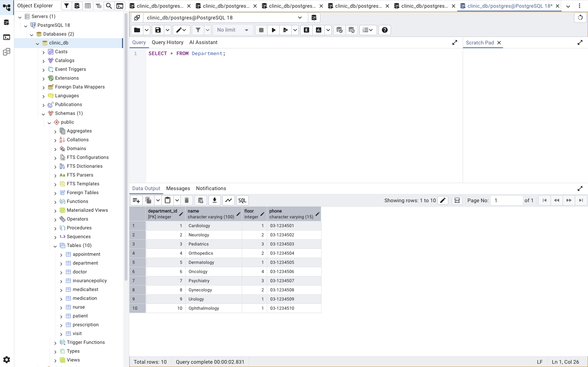

# מיני פרויקט בסיסי נתונים — קליניקה רפואית

## שער
**מגישים:** Roy Shem Tov (200042729) | Ori Winograd (331097410)
**שם המערכת:** MediFlow — מערכת ניהול קליניקה רפואית
**תאריך הגשה:** 13/04/2026

---

## תוכן עניינים
1. מבוא
2. מסכי המערכת
3. תרשים ERD
4. תרשים DSD
5. החלטות עיצוב
6. שיטות הכנסת נתונים
7. גיבוי ושחזור

---

## 1. מבוא

מערכת MediFlow היא מערכת ניהול קליניקה רפואית המאפשרת ניהול מטופלים, תורים, רופאים ורשומות רפואיות.

**הנתונים הנשמרים במערכת:**
- פרטי מטופלים (שם, תאריך לידה, טלפון, כתובת, ביטוח)
- פרטי רופאים ואחיות (שם, התמחות, מחלקה)
- ניהול תורים (תאריך, שעה, סטטוס)
- ביקורים ואבחנות רפואיות
- מרשמים ותרופות
- בדיקות רפואיות ותוצאותיהן

**הפונקציונאליות העיקרית:**
- קביעת תורים ומעקב אחר סטטוסם
- תיעוד ביקורים ואבחנות
- ניהול מרשמים ותרופות
- צפייה בתוצאות בדיקות
- ניהול ביטוחי מטופלים

---

## 2. מסכי המערכת

המסכים נוצרו בעזרת Google AI Studio.
**לינק לאפליקציה:** https://aistudio.google.com/prompts/190_XYT5-ZDsGzGkIizTEiP0bFTndEfuW

### מסך 1 — ניהול מטופלים

### מסך 2 — ניהול תורים

### מסך 3 — רופאים ומחלקות

### מסך 4 — רשומות רפואיות

---

## 3. תרשים ERD

---

## 4. תרשים DSD

---

## 5. החלטות עיצוב

**1. בחרנו קליניקה כללית** — כי יש בה הרבה ישויות טבעיות שמתחברות אחת לשנייה ומאפשרות שאילתות מעניינות.

**2. 10 ישויות במקום 6** — בחרנו יותר מהמינימום כדי להעשיר את הפרויקט ולאפשר שאילתות מורכבות יותר.

**3. הפרדנו Doctor ו-Nurse לטבלאות נפרדות** — כי לכל אחד מהם תפקיד שונה במערכת. זה גם מאפשר לנו לנהל כוח אדם בצורה מדויקת יותר.

**4. יצרנו טבלת Visit נפרדת** — במקום לשמור את האבחנה בתוך Appointment, כי ביקור מתועד הוא אירוע שונה מתור.

**5. InsurancePolicy מחוברת למטופל** — כי ביטוח שייך למטופל ספציפי ולא לביקור.

**6. שדות DATE משמעותיים** — בחרנו 6 שדות תאריך: birth_date, appointment_date, visit_date, test_date, expiry_date, start_date — כולם משמשים לשאילתות משמעותיות.

**7. נרמול 3NF** — כל מידע נשמר פעם אחת בלבד בטבלה המתאימה לו.

**8. אילוצים** — הוספנו CHECK על status בטבלת Appointment, NOT NULL על שדות חובה, ו-UNIQUE על email.

---

## 6. שיטות הכנסת נתונים

### שיטה 1 — INSERT ידני
הוכנסו נתונים ידנית לטבלאות Department ו-Medication.

### שיטה 2 — סקריפט Python
נכתב סקריפט Python שייצר 20,000 רשומות לטבלאות Patient ו-Appointment.

### שיטה 3 — Mockaroo
הוכנסו נתונים דרך האתר mockaroo.com לטבלאות Nurse, Visit, Prescription, MedicalTest, InsurancePolicy.

---

## 7. גיבוי ושחזור

בוצע גיבוי של בסיס הנתונים דרך pgAdmin.
שם קובץ הגיבוי: `backup_13_04_2026.backup`

