# מיני פרויקט בסיסי נתונים — קליניקה רפואית

## שער
**מגישים:** Roy Shem Tov (200042729) | Ori Winograd (331097410)
**שם המערכת:** clinic_db — מערכת ניהול קליניקה רפואית
**תאריך הגשה שלב א':** 13/04/2026
**תאריך הגשה שלב ב':** 12/05/2026

---

## תוכן עניינים
1. מבוא
2. מסכי המערכת
3. תרשים ERD
4. תרשים DSD
5. החלטות עיצוב
6. שיטות הכנסת נתונים
7. גיבוי ושחזור
8. **דוח שלב ב': שאילתות, אילוצים ואינדקסים**

---

## 1. מבוא

מערכת clinic_db היא מערכת ניהול קליניקה רפואית המאפשרת ניהול מטופלים, תורים, רופאים ורשומות רפואיות.

**הנתונים הנשמרים במערכת:**
- פרטי מטופלים (שם, תאריך לידה, טלפון, כתובת, ביטוח)
- פרטי רופאים ואחיות (שם, התמחות, מחלקה)
- ניהול תורים (תאריך, שעה, סטטוס)
- ביקורים ואבחנות רפואיות
- מרשמים ותרופות
- בדיקות רפואיות ותוצאותיהן

**הפונקציונאליות העיקרית:**
- קביעת תורים ומעקב אחר סטטוסם
- תיעוד ביקורים ואבחנות
- ניהול מרשמים ותרופות
- צפייה בתוצאות בדיקות
- ניהול ביטוחי מטופלים

---

## 2. מסכי המערכת

המסכים נוצרו בעזרת Google AI Studio.
**לינק לאפליקציה:** https://aistudio.google.com/prompts/190_XYT5-ZDsGzGkIizTEiP0bFTndEfuW

### מסך 1 — ניהול מטופלים


### מסך 2 — ניהול תורים


### מסך 3 — רופאים ומחלקות


### מסך 4 — רשומות רפואיות


---

## 3. תרשים ERD


---

## 4. תרשים DSD


---

## 5. החלטות עיצוב

**1. בחרנו קליניקה כללית** — כי יש בה הרבה ישויות טבעיות שמתחברות אחת לשנייה ומאפשרות שאילתות מעניינות.

**2. 10 ישויות במקום 6** — בחרנו יותר מהמינימום כדי להעשיר את הפרויקט ולאפשר שאילתות מורכבות יותר.

**3. הפרדנו Doctor ו-Nurse לטבלאות נפרדות** — כי לכל אחד מהם תפקיד שונה במערכת. זה גם מאפשר לנו לנהל כוח אדם בצורה מדויקת יותר.

**4. יצרנו טבלת Visit נפרדת** — במקום לשמור את האבחנה בתוך Appointment, כי ביקור מתועד הוא אירוע שונה מתור.

**5. InsurancePolicy מחוברת למטופל** — כי ביטוח שייך למטופל ספציפי ולא לביקור.

**6. שדות DATE משמעותיים** — בחרנו 6 שדות תאריך: birth_date, appointment_date, visit_date, test_date, expiry_date, start_date — כולם משמשים לשאילתות משמעותיות.

**7. נרמול 3NF** — כל מידע נשמר פעם אחת בלבד בטבלה המתאימה לו.

**8. אילוצים** — הוספנו CHECK על status בטבלת Appointment, NOT NULL על שדות חובה, ו-UNIQUE על email.

---

## 6. שיטות הכנסת נתונים

### שיטה 1 — ייבוא CSV
יובאו נתונים לטבלת Department מקובץ CSV בעזרת פקודת \copy.
הקובץ נמצא בתיקיית DataImportFiles.


### שיטה 2 — סקריפט Python
נכתב סקריפט Python שייצר 20,000 רשומות לטבלאות Patient ו-Appointment.
הקוד נמצא בתיקיית Programing.


### שיטה 3 — Mockaroo
הוכנסו נתונים דרך האתר mockaroo.com לטבלאות Nurse, Visit, Prescription, MedicalTest, InsurancePolicy.
הקבצים נמצאים בתיקיית mockarooFiles.


---

## 7. גיבוי ושחזור

בוצע גיבוי של בסיס הנתונים דרך pgAdmin.
שם קובץ הגיבוי: `backup_13_04_2026.backup`


---

# 8. דוח שלב ב': שאילתות, אילוצים ואינדקסים

## הקדמה
בשלב זה ביצענו תשאול מקיף של בסיס הנתונים, כולל 8 שאילתות SELECT מורכבות, 3 שאילתות UPDATE, 3 שאילתות DELETE, הדגמות ROLLBACK ו-COMMIT, הוספת 3 אילוצים חדשים והוספת 3 אינדקסים לשיפור ביצועים.

**שינויים בטבלאות:** במהלך השלב נדרשו הוספות עמודות (ALTER TABLE) כדי לתמוך בשאילתות. השינויים תועדו בקובץ AlterTables.sql.

---

## חלק 1: 4 שאילתות SELECT כפולות (השוואת יעילות)

### שאילתה 1: מטופלים עם תורים עתידיים לקרדיולוגיה

**תיאור:** השאילתה מציגה את פרטי המטופלים שיש להם תור עתידי במחלקת קרדיולוגיה, כולל פירוק תאריך לחודש. שאילתה זו תופיע במסך ניהול תורים, לסינון מטופלים לפי מחלקה ותאריך.

**דרך א' — INNER JOIN (היעילה):**
```sql
SELECT p.first_name, p.last_name, p.phone, a.appointment_date, 
       EXTRACT(MONTH FROM a.appointment_date) as appt_month
FROM Patient p
INNER JOIN Appointment a ON p.patient_id = a.patient_id
INNER JOIN Doctor d ON a.doctor_id = d.doctor_id
INNER JOIN Department dep ON d.department_id = dep.department_id
WHERE dep.name = 'Cardiology' AND a.appointment_date > CURRENT_DATE;
```

**צילום הרצה ותוצאה:**
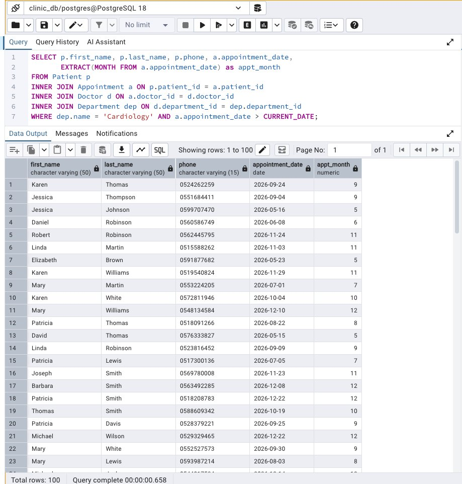

**דרך ב' — תת-שאילתות מקוננות:**
```sql
SELECT p.first_name, p.last_name, p.phone, a.appointment_date,
       EXTRACT(MONTH FROM a.appointment_date) as appt_month
FROM Patient p, Appointment a
WHERE p.patient_id = a.patient_id
  AND a.appointment_date > CURRENT_DATE
  AND a.doctor_id IN (
      SELECT doctor_id FROM Doctor WHERE department_id IN (
          SELECT department_id FROM Department WHERE name = 'Cardiology'
      )
  );
```

**צילום הרצה ותוצאה:**
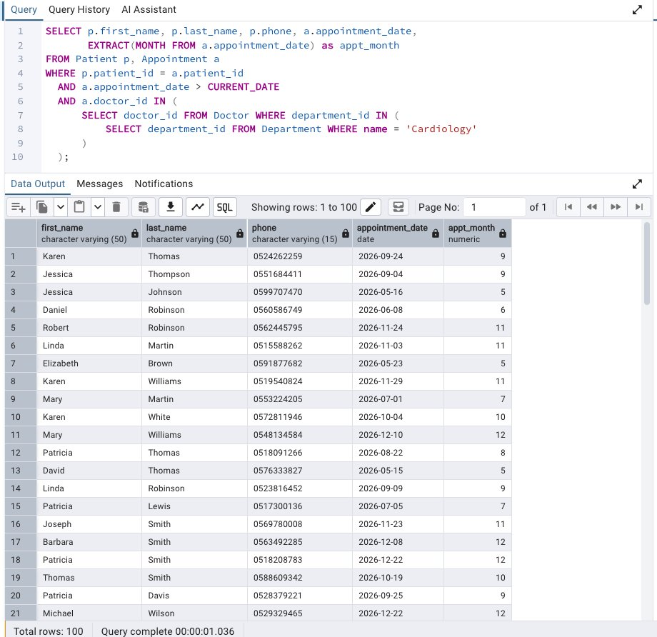

**הסבר ההבדל ביעילות:**
- **דרך א' (JOIN):** רצה בזמן של 658 מילישניות. ה-INNER JOIN מבצע חיבור יעיל בין הטבלאות תוך שימוש באלגוריתמים מוטבים של ה-DB (Hash Join או Merge Join).
- **דרך ב' (תת-שאילתות):** רצה בזמן של 1036 מילישניות. ה-DB צריך להעריך 3 תת-שאילתות מקוננות, מה שמחייב סריקות נוספות. אופטימייזר מודרני אולי יתרגם זאת ל-JOIN פנימית, אך לעיתים זה גורר תקורה נוספת.
- **JOIN יעיל יותר בכ-40%.**

---

### שאילתה 2: רשימת רופאים וכמות ביקורים בשנה הנוכחית

**תיאור:** סטטיסטיקה של מספר הביקורים לכל רופא בשנה הנוכחית. השאילתה תופיע במסך סטטיסטיקות הקליניקה.

**דרך א' — JOIN + GROUP BY (היעילה):**
```sql
SELECT d.first_name, d.last_name, dep.name AS department, COUNT(v.visit_id) as total_visits
FROM Doctor d
INNER JOIN Department dep ON d.department_id = dep.department_id
LEFT JOIN Visit v ON d.doctor_id = v.doctor_id 
  AND EXTRACT(YEAR FROM v.visit_date) = EXTRACT(YEAR FROM CURRENT_DATE)
GROUP BY d.doctor_id, d.first_name, d.last_name, dep.name
ORDER BY total_visits DESC;
```

**צילום הרצה ותוצאה:**
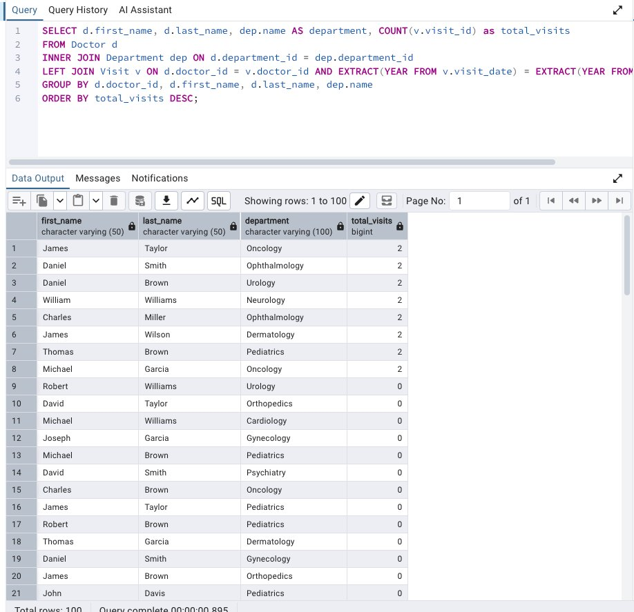

**דרך ב' — Correlated Subquery:**
```sql
SELECT d.first_name, d.last_name, 
       (SELECT name FROM Department WHERE department_id = d.department_id) AS department,
       (SELECT COUNT(*) FROM Visit v 
        WHERE v.doctor_id = d.doctor_id 
          AND EXTRACT(YEAR FROM v.visit_date) = EXTRACT(YEAR FROM CURRENT_DATE)
       ) as total_visits
FROM Doctor d
ORDER BY total_visits DESC;
```

**צילום הרצה ותוצאה:**
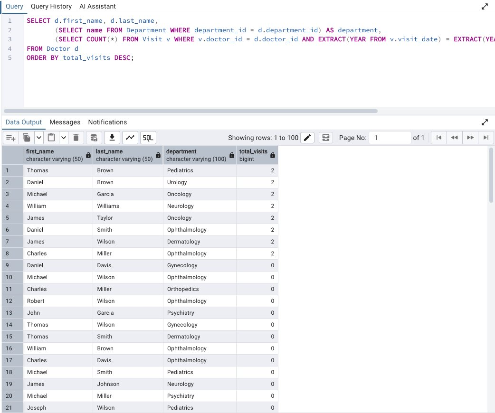

**הסבר ההבדל ביעילות:**
- **דרך א' (JOIN + GROUP BY):** רצה בזמן של 895 מילישניות. ה-DB מבצע GROUP BY פעם אחת על הטבלה המאוחדת.
- **דרך ב' (Correlated Subquery):** איטית משמעותית — לכל שורה ב-Doctor, ה-DB מבצע 2 תת-שאילתות נפרדות. אם יש 100 רופאים, זה מסתכם ב-200 תת-שאילתות.
- **JOIN יעיל יותר בעיקר ככל שמספר הרופאים גדל.**

---

### שאילתה 3: מטופלים עם פוליסות ביטוח שפג תוקפן ב-2026

**תיאור:** איתור מטופלים שפוליסת הביטוח שלהם פגה השנה (להתראה למטופל). השאילתה תופיע במסך ניהול ביטוחים.

**דרך א' — EXISTS:**
```sql
SELECT p.patient_id, p.first_name, p.last_name, p.email, p.phone
FROM Patient p
WHERE EXISTS (
    SELECT 1 
    FROM InsurancePolicy ip 
    WHERE ip.patient_id = p.patient_id 
      AND EXTRACT(YEAR FROM ip.expiry_date) = 2026
);
```

**צילום הרצה ותוצאה:**
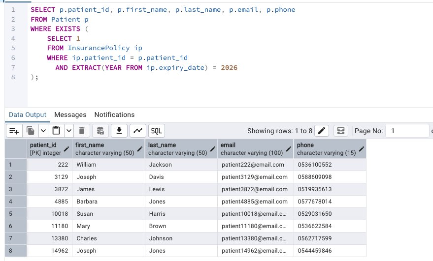

**דרך ב' — INNER JOIN עם DISTINCT:**
```sql
SELECT DISTINCT p.patient_id, p.first_name, p.last_name, p.email, p.phone
FROM Patient p
INNER JOIN InsurancePolicy ip ON p.patient_id = ip.patient_id
WHERE EXTRACT(YEAR FROM ip.expiry_date) = 2026;
```

**צילום הרצה ותוצאה:**
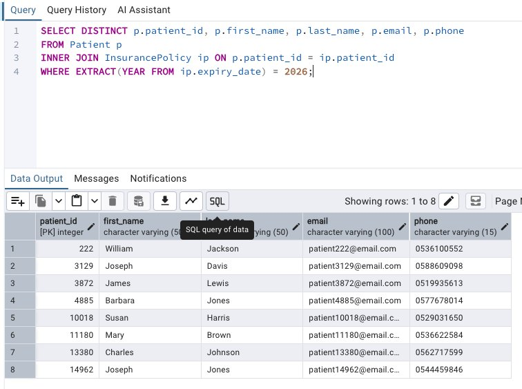

**הסבר ההבדל ביעילות:**
- **דרך א' (EXISTS):** עוצרת את הסריקה ברגע שמצאה התאמה ראשונה למטופל (Short-circuit evaluation).
- **דרך ב' (JOIN + DISTINCT):** מבצעת חיבור מלא של הטבלאות ואז מסירה כפילויות. ה-DISTINCT מוסיף שלב של מיון או הצבה.
- **EXISTS יעיל יותר כשמטופל יכול להופיע במספר פוליסות**, כי הוא לא יוצר שורות מיותרות שצריך לסנן.

---

### שאילתה 4: תרופות שנרשמו במרשמים יותר מ-10 פעמים

**תיאור:** מציאת התרופות הנפוצות במרפאה. השאילתה תופיע בדוח התרופות המנוהלות.

**דרך א' — GROUP BY + HAVING (היעילה):**
```sql
SELECT m.name, m.manufacturer, m.type, COUNT(p.prescription_id) as times_prescribed
FROM Medication m
INNER JOIN Prescription p ON m.medication_id = p.medication_id
GROUP BY m.medication_id, m.name, m.manufacturer, m.type
HAVING COUNT(p.prescription_id) > 10;
```

**צילום הרצה ותוצאה:**
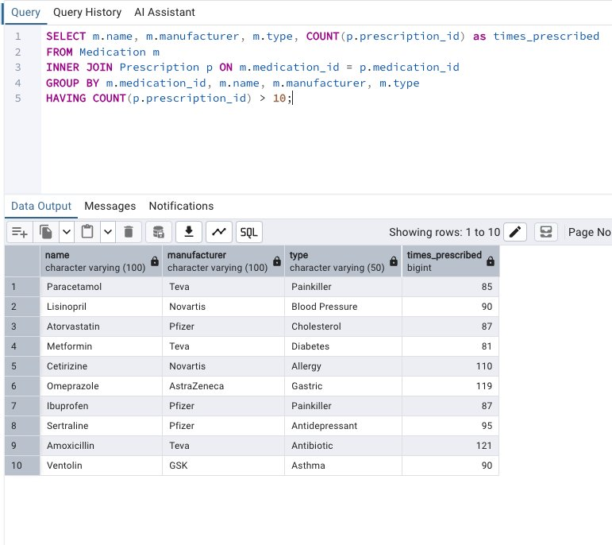

**דרך ב' — CTE (Common Table Expression):**
```sql
WITH PrescriptionCounts AS (
    SELECT medication_id, COUNT(*) as p_count
    FROM Prescription
    GROUP BY medication_id
)
SELECT m.name, m.manufacturer, m.type, pc.p_count as times_prescribed
FROM Medication m
INNER JOIN PrescriptionCounts pc ON m.medication_id = pc.medication_id
WHERE pc.p_count > 10;
```

**צילום הרצה ותוצאה:**
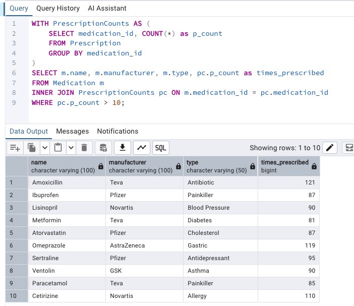

**הסבר ההבדל ביעילות:**
- **שתי הדרכים מחזירות אותן 10 תרופות בדיוק.**
- **GROUP BY + HAVING (דרך א'):** מבוצע בשלב אחד בתוך תכנון השאילתה.
- **CTE (דרך ב'):** הטבלה הזמנית נוצרת תחילה, ואז משולבת. אופטימייזר מודרני של PostgreSQL מאופטם CTE ולכן ההבדל בביצועים מינימלי במקרה זה.
- **CTE עדיף בקריאות לשאילתות מורכבות, אך GROUP BY ישיר מנצח בסיטואציות פשוטות.**

---

## חלק 2: 4 שאילתות SELECT נוספות

### שאילתה 5: היסטוריה רפואית מלאה למטופל

**תיאור:** שליפת תיק רפואי מלא של מטופל ספציפי (כולל ביקורים, אבחנות, רופאים ומרשמים). תופיע במסך תיק רפואי של מטופל.

```sql
SELECT p.first_name || ' ' || p.last_name AS patient_name, 
       v.visit_date, EXTRACT(YEAR FROM v.visit_date) as visit_year, 
       v.diagnosis, d.last_name AS doctor_name, m.name AS medication_prescribed
FROM Patient p
INNER JOIN Visit v ON p.patient_id = v.patient_id
INNER JOIN Doctor d ON v.doctor_id = d.doctor_id
LEFT JOIN Prescription pr ON v.visit_id = pr.visit_id
LEFT JOIN Medication m ON pr.medication_id = m.medication_id
WHERE p.patient_id = 4905 
ORDER BY v.visit_date DESC;
```

**צילום הרצה ותוצאה:**
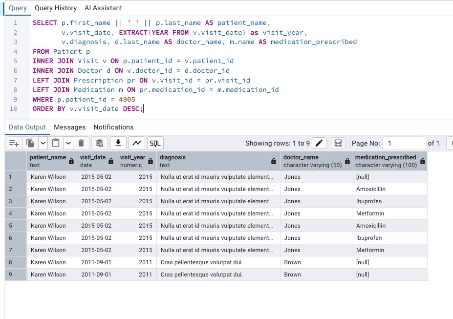

---

### שאילתה 6: בדיקות רפואיות למטופלים מעל גיל 60

**תיאור:** שליפת בדיקות עבור מטופלים מבוגרים. תופיע במסך דוחות לאוכלוסיות יעד.

```sql
SELECT mt.test_date, mt.test_type, mt.result, p.first_name, p.last_name, 
       EXTRACT(YEAR FROM AGE(CURRENT_DATE, p.birth_date)) AS age
FROM MedicalTest mt
INNER JOIN Patient p ON mt.patient_id = p.patient_id
WHERE EXTRACT(YEAR FROM AGE(CURRENT_DATE, p.birth_date)) > 60
ORDER BY mt.test_date DESC;
```

**צילום הרצה ותוצאה:**
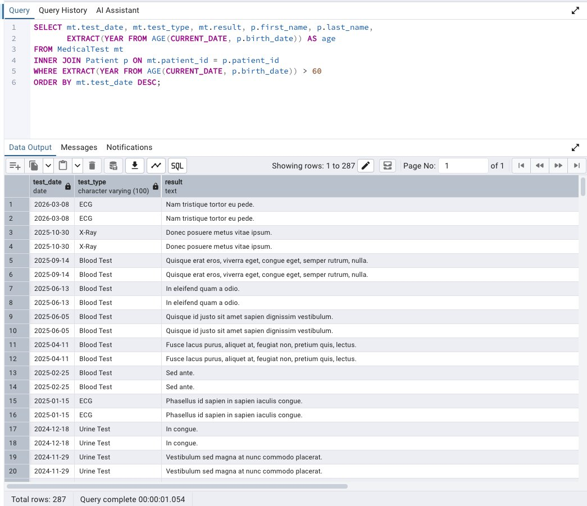

---

### שאילתה 7: כמות תורים שבוטלו לפי מחלקה וקומה

**תיאור:** דוח המציג אילו מחלקות סובלות מהכי הרבה ביטולי תורים, כולל קומה. תופיע במסך סטטיסטיקות.

```sql
SELECT dep.name AS department_name, 
       dep.floor AS department_floor,
       COUNT(a.appointment_id) AS cancelled_appointments
FROM Appointment a
INNER JOIN Doctor d ON a.doctor_id = d.doctor_id
INNER JOIN Department dep ON d.department_id = dep.department_id
WHERE a.status = 'cancelled'
GROUP BY dep.name, dep.floor
ORDER BY cancelled_appointments DESC;
```

**צילום הרצה ותוצאה:**
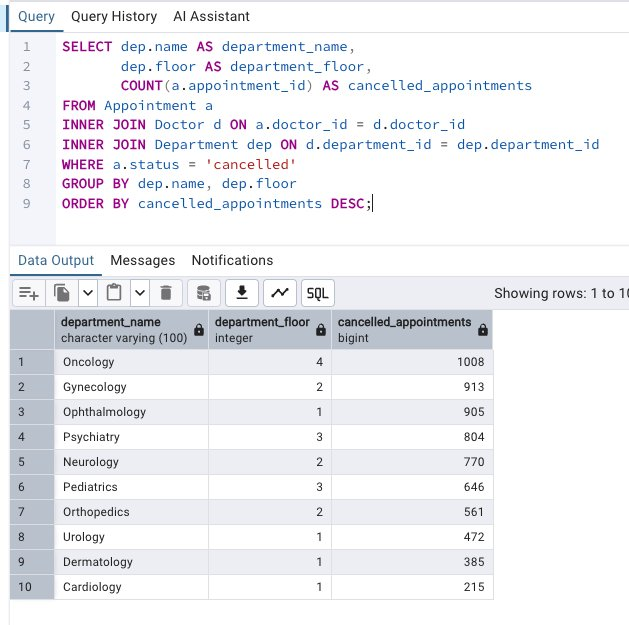

---

### שאילתה 8: אחיות ותיקות עם פרטי מחלקתן

**תיאור:** רשימת האחיות שהחלו לעבוד לפני 2020, כולל המחלקה שלהן ושנות הוותק. תופיע במסך ניהול כוח אדם.

```sql
SELECT n.first_name, n.last_name, n.email, dep.name AS department_name, 
       n.start_date, EXTRACT(YEAR FROM AGE(CURRENT_DATE, n.start_date)) as years_of_service
FROM Nurse n
INNER JOIN Department dep ON n.department_id = dep.department_id
WHERE EXTRACT(YEAR FROM n.start_date) < 2020
ORDER BY years_of_service DESC;
```

**צילום הרצה ותוצאה:**
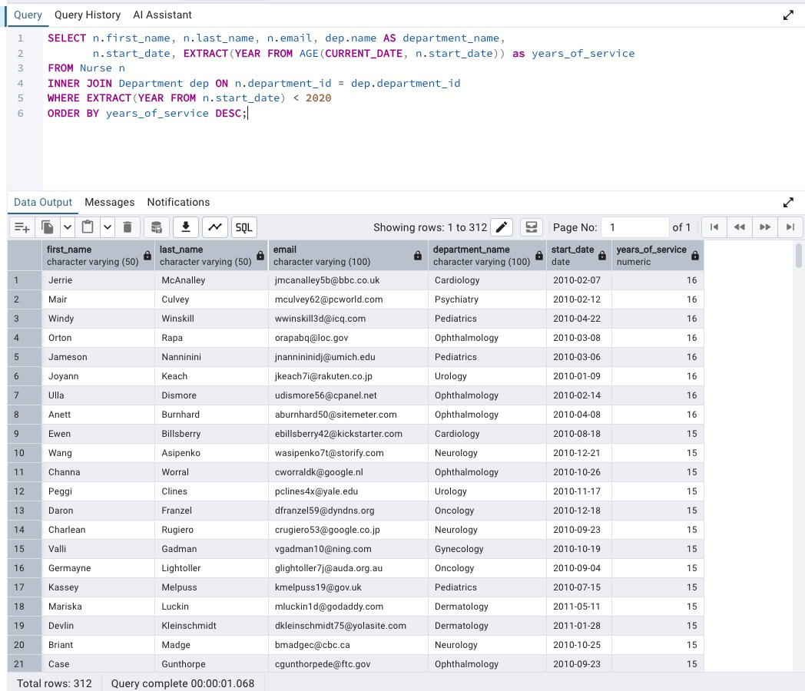

---

## חלק 3: שאילתות UPDATE

### UPDATE 1: עדכון סטטוס תורים שעבר זמנם

**תיאור:** הפיכת תורים שתאריכם עבר (status='scheduled' ולא נוכחו) לסטטוס 'completed' אוטומטית, עם תיוג בהערות.

```sql
UPDATE Appointment 
SET status = 'completed', 
    notes = COALESCE(notes, '') || ' (System updated)' 
WHERE appointment_date < CURRENT_DATE 
  AND status = 'scheduled';
```

**מצב לפני העדכון:**
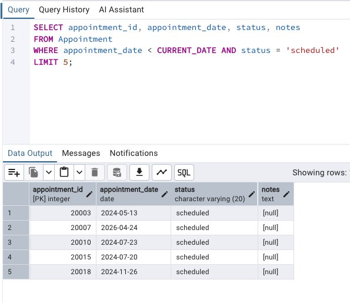

**הרצת UPDATE — 5,720 שורות עודכנו:**
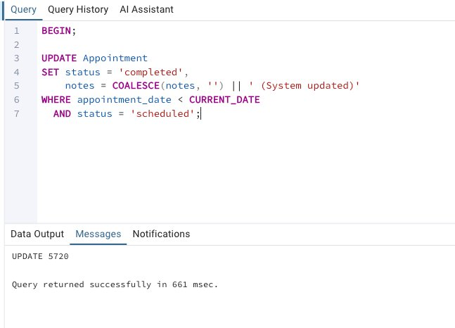

**מצב אחרי העדכון:**
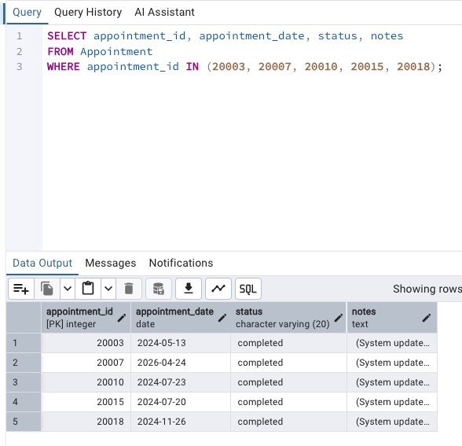

---

### UPDATE 2: העלאת סכום הכיסוי הביטוחי ב-10% לפוליסות 2026

**תיאור:** מתן הטבה למטופלים שפוליסת ביטוחם תפוג השנה - העלאה אוטומטית של 10% בכיסוי.

```sql
UPDATE InsurancePolicy 
SET coverage_amount = coverage_amount * 1.10 
WHERE EXTRACT(YEAR FROM expiry_date) = 2026;
```

**מצב לפני העדכון:**
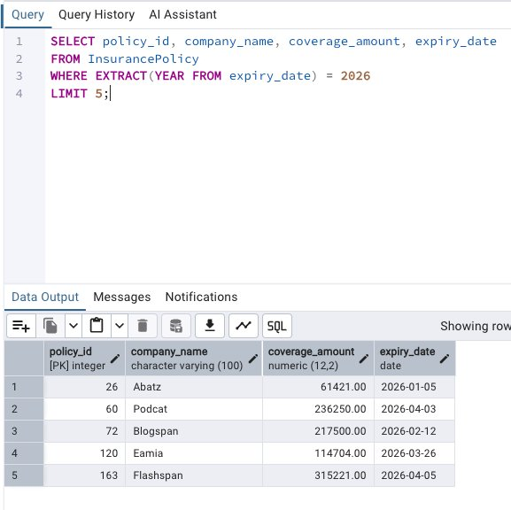

**הרצת UPDATE — 8 שורות עודכנו:**
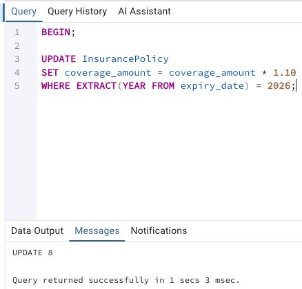

**מצב אחרי העדכון:** (סכומים גדלו ב-10%)
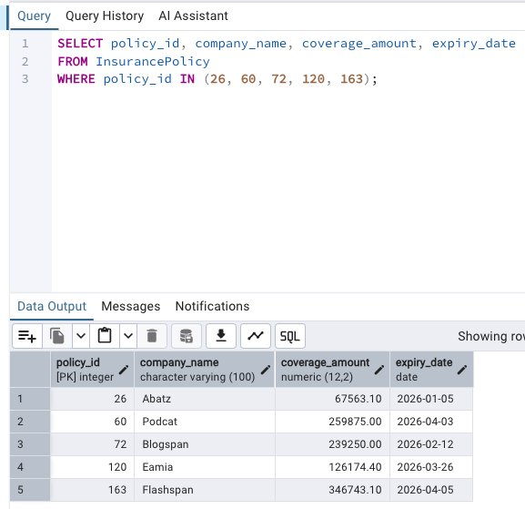

---

### UPDATE 3: הנחה של 5% על משככי כאבים

**תיאור:** מבצע הנחה זמנית על משככי כאבים. הפחתת מחיר ב-5% לכל התרופות מסוג 'Painkiller'.

```sql
UPDATE Medication 
SET price = price * 0.95 
WHERE type = 'Painkiller';
```

**מצב לפני העדכון:** (Ibuprofen: 15.00, Paracetamol: 10.00)
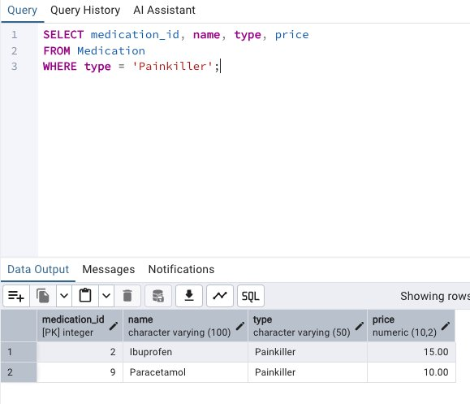

**הרצת UPDATE — 2 שורות עודכנו:**
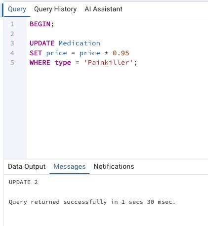

**מצב אחרי העדכון:** (Ibuprofen: 14.25, Paracetamol: 9.50)
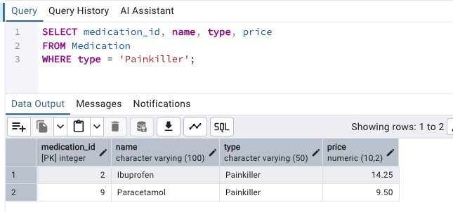

---

## חלק 4: שאילתות DELETE

### DELETE 1: מחיקת תורים מבוטלים ישנים

**תיאור:** ניקוי תורים שבוטלו לפני 2024 כדי לשמור על הטבלה רזה.

```sql
DELETE FROM Appointment 
WHERE status = 'cancelled' 
  AND appointment_date < '2024-01-01';
```

**מצב לפני המחיקה — 1,657 שורות עומדות להימחק:**
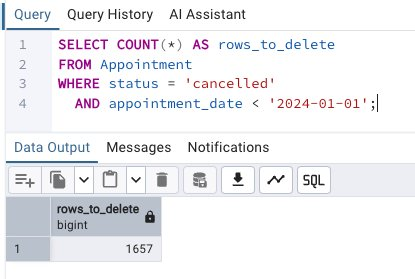

**הרצת DELETE — 1,657 שורות נמחקו:**
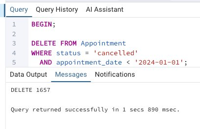

**מצב אחרי המחיקה — 0 שורות נשארו:**
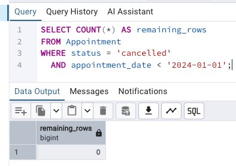

---

### DELETE 2: מחיקת מרשמים ישנים מאוד

**תיאור:** ניקוי מרשמים שניתנו לפני 2013 - הם כבר לא רלוונטיים רפואית.

```sql
DELETE FROM Prescription 
WHERE prescription_date < '2013-01-01';
```

**מצב לפני המחיקה — 177 שורות עומדות להימחק:**
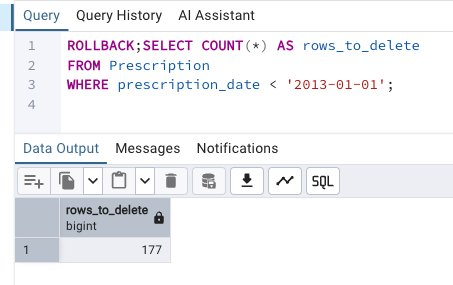

**הרצת DELETE — 177 שורות נמחקו:**
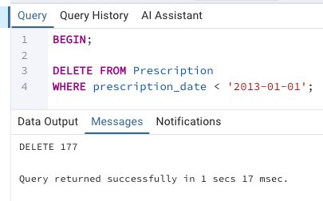

**מצב אחרי המחיקה — 0 שורות נשארו:**
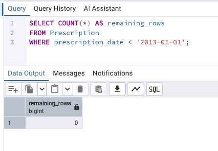

---

### DELETE 3: מחיקת בדיקות רפואיות ישנות

**תיאור:** ניקוי בדיקות רפואיות מלפני 2015 - מעבר לתקופת השמירה הנדרשת.

```sql
DELETE FROM MedicalTest 
WHERE test_date < '2015-01-01';
```

**מצב לפני המחיקה — 332 שורות עומדות להימחק:**
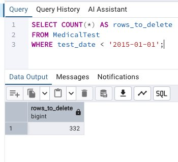

**הרצת DELETE — 332 שורות נמחקו:**
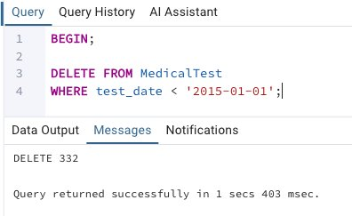

**מצב אחרי המחיקה — 0 שורות נשארו:**
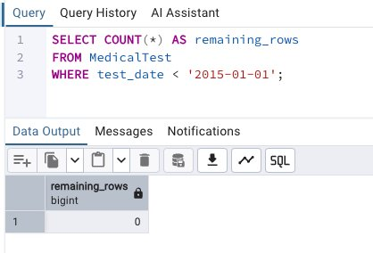

---

## חלק 5: ROLLBACK ו-COMMIT

### דוגמת ROLLBACK
הדגמה של ביטול שינוי בעזרת ROLLBACK. נשנה בטעות התמחות רופא מספר 1, ונבטל את השינוי.

```sql
-- מצב 1: לפני השינוי
SELECT doctor_id, specialization FROM Doctor WHERE doctor_id = 1;

BEGIN;
-- שינוי בטעות
UPDATE Doctor SET specialization = 'Unknown' WHERE doctor_id = 1;

-- מצב 2: השינוי קרה בתוך הטרנזקציה
SELECT doctor_id, specialization FROM Doctor WHERE doctor_id = 1;

ROLLBACK;
-- מצב 3: הטרנזקציה בוטלה, הנתונים חזרו
SELECT doctor_id, specialization FROM Doctor WHERE doctor_id = 1;
```

**מצב 1 — לפני (specialization = Gynecology):**
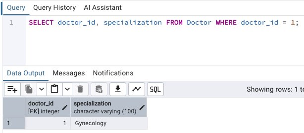

**מצב 2 — אחרי UPDATE בתוך הטרנזקציה (specialization = Unknown):**
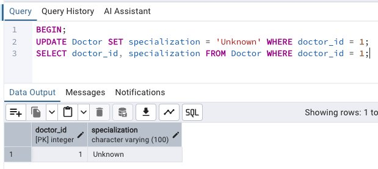

**מצב 3 — אחרי ROLLBACK (specialization חזר ל-Gynecology):**
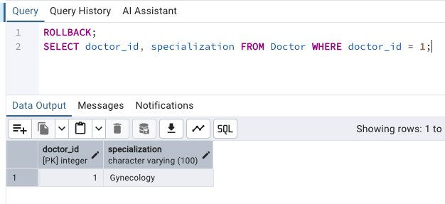

---

### דוגמת COMMIT
הדגמה של שמירת שינוי לתמיד בעזרת COMMIT. נבטל תור מספר 20003.

```sql
-- מצב 1: לפני השינוי
SELECT appointment_id, status FROM Appointment WHERE appointment_id = 20003;

BEGIN;
-- שינוי
UPDATE Appointment SET status = 'cancelled' WHERE appointment_id = 20003;

-- מצב 2: השינוי קרה בתוך הטרנזקציה
SELECT appointment_id, status FROM Appointment WHERE appointment_id = 20003;

COMMIT;
-- מצב 3: השינוי נשמר לתמיד
SELECT appointment_id, status FROM Appointment WHERE appointment_id = 20003;
```

**מצב 1 — לפני (status = scheduled):**
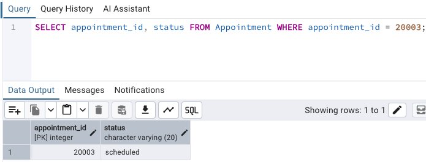

**מצב 2 — אחרי UPDATE בתוך הטרנזקציה (status = cancelled):**
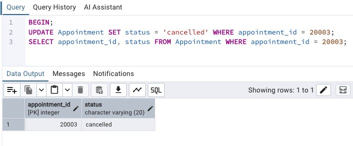

**מצב 3 — אחרי COMMIT (status נשמר כ-cancelled):**
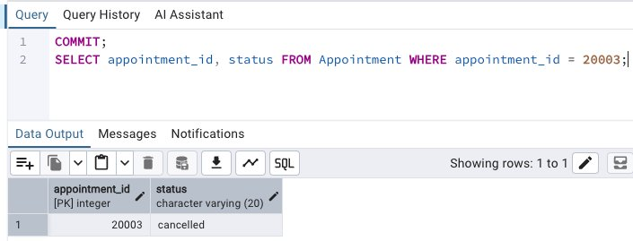

---

## חלק 6: אילוצים חדשים (Constraints)

הוספנו 3 אילוצי CHECK חדשים, כל אחד אוכף תקינות נתונים שונה. עבור כל אילוץ, ניסינו להפר אותו ב-INSERT/UPDATE מכוון, וראינו ש-PostgreSQL חוסם את הפעולה עם שגיאת constraint violation.

### אילוץ 1: תאריך לידה לא יכול להיות בעתיד

**מוטיבציה:** אדם לא יכול להיוולד בעתיד. ללא אילוץ, נתונים שגויים יכולים לחדור למערכת.

**תועלת:** מבטיח שכל מטופל במערכת קיים פיזית כיום.

```sql
ALTER TABLE Patient DROP CONSTRAINT IF EXISTS chk_patient_birth_date;
ALTER TABLE Patient ADD CONSTRAINT chk_patient_birth_date 
    CHECK (birth_date <= CURRENT_DATE);
```

**ניסיון הפרה — שגיאה כצפוי:**
```sql
INSERT INTO Patient (first_name, last_name, birth_date) 
VALUES ('Future', 'Person', '2050-01-01');
```

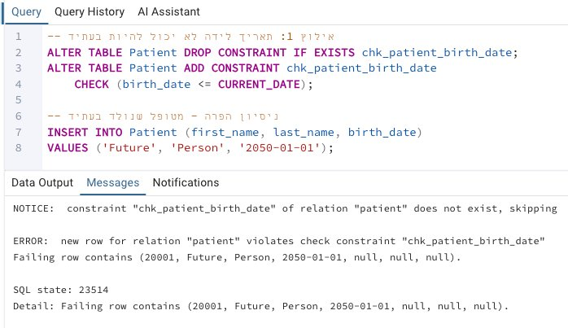

---

### אילוץ 2: שעת תור חייבת להיות בין 08:00 ל-20:00

**מוטיבציה:** הקליניקה פועלת בשעות מוגדרות. תורים מחוץ לשעות פעילות אינם תקפים.

**תועלת:** מונע יצירת תורים שגויים בלילה או מוקדם בבוקר.

```sql
ALTER TABLE Appointment DROP CONSTRAINT IF EXISTS chk_appointment_time;
ALTER TABLE Appointment ADD CONSTRAINT chk_appointment_time 
    CHECK (appointment_time >= '08:00:00' AND appointment_time <= '20:00:00');
```

**ניסיון הפרה — שגיאה כצפוי:**
```sql
INSERT INTO Appointment (appointment_date, appointment_time, status, patient_id, doctor_id) 
VALUES ('2026-12-01', '23:00:00', 'scheduled', 1, 1);
```

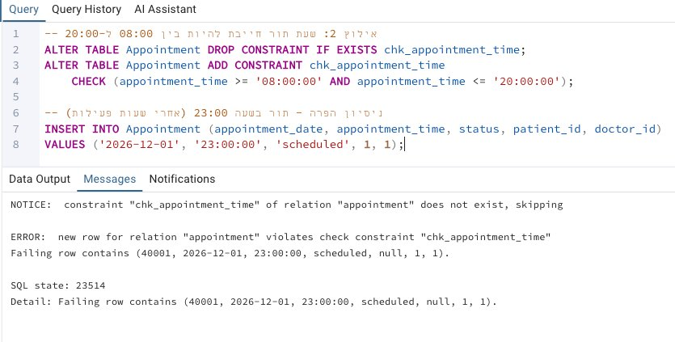

---

### אילוץ 3: מחיר תרופה חייב להיות חיובי

**מוטיבציה:** מחירים שליליים אינם הגיוניים מבחינה עסקית.

**תועלת:** מונע טעויות הזנה ושגיאות חישוב כספיות.

```sql
ALTER TABLE Medication DROP CONSTRAINT IF EXISTS chk_medication_price;
ALTER TABLE Medication ADD CONSTRAINT chk_medication_price 
    CHECK (price >= 0);
```

**ניסיון הפרה — שגיאה כצפוי:**
```sql
UPDATE Medication SET price = -100 WHERE medication_id = 1;
```

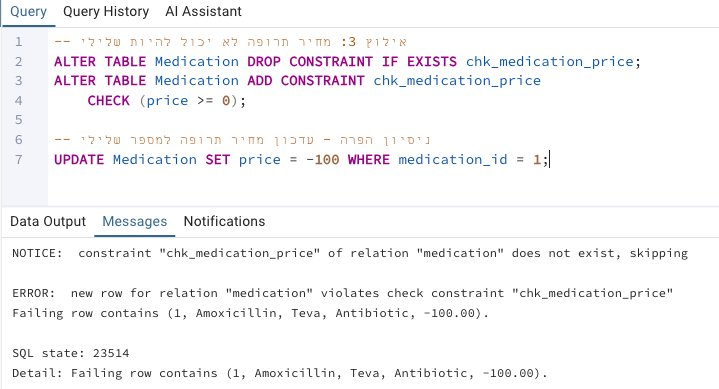

---

## חלק 7: אינדקסים (Indexes)

הוספנו 3 אינדקסים על עמודות שמשמשות בשאילתות תכופות. עבור כל אינדקס מדדנו את זמן הביצוע לפני ואחרי בעזרת `EXPLAIN ANALYZE`.

### אינדקס 1: idx_patient_name

**מוטיבציה:** חיפושים בשם המטופל (last_name + first_name) הם מאוד נפוצים — בכל פנייה של מטופל לקבלה צריך לחפש אותו לפי השם.

**תועלת:** האצת חיפושים בטבלת Patient (20,000 רשומות).

```sql
DROP INDEX IF EXISTS idx_patient_name;
CREATE INDEX idx_patient_name ON Patient(last_name, first_name);
```

**זמן ריצה לפני האינדקס — Seq Scan, 3.497ms:**
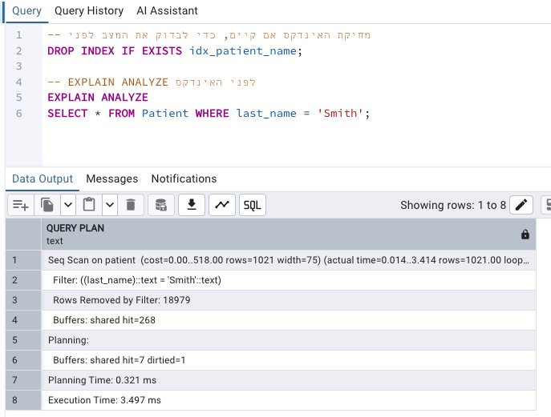

**זמן ריצה אחרי האינדקס — Bitmap Index Scan, 0.480ms:**
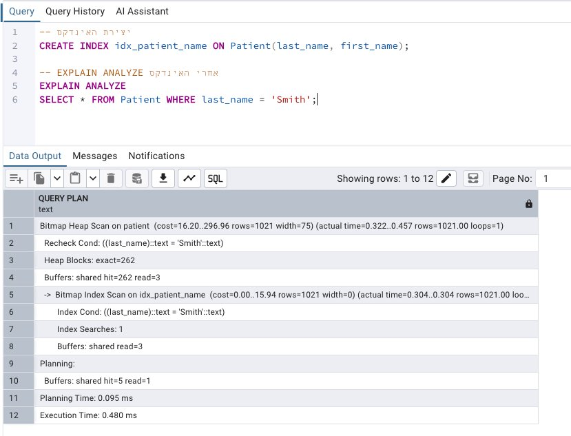

**הסבר התוצאות:** 
לפני האינדקס, PostgreSQL ביצע Seq Scan וסרק את כל 20,000 השורות בטבלה, מסיר 18,979 שורות לא תואמות. אחרי האינדקס, השימוש ב-Bitmap Index Scan מאפשר להגיע ישירות לרשומות התואמות. **שיפור של 7.3x מהיר יותר.**

---

### אינדקס 2: idx_appointment_date_doctor

**מוטיבציה:** השאלה "אילו תורים יש לרופא X בתאריך Y" היא הבסיסית ביותר במערכת לוחות זמנים של קליניקה.

**תועלת:** האצת חיפוש תורים ספציפיים בטבלת Appointment (20,000 רשומות).

```sql
DROP INDEX IF EXISTS idx_appointment_date_doctor;
CREATE INDEX idx_appointment_date_doctor ON Appointment(appointment_date, doctor_id);
```

**זמן ריצה לפני האינדקס — Seq Scan, 1.363ms:**
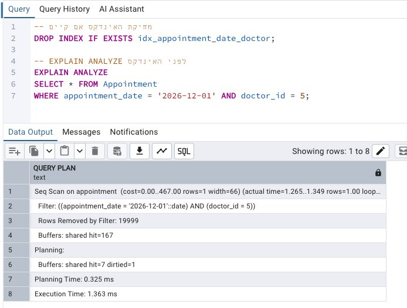

**זמן ריצה אחרי האינדקס — Index Scan, 0.031ms:**
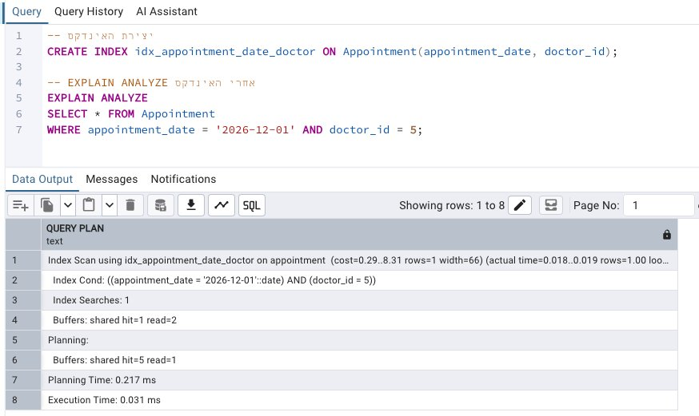

**הסבר התוצאות:**
לפני האינדקס, PostgreSQL ביצע Seq Scan וסרק 20,000 שורות. אחרי האינדקס, ה-Index Scan מאפשר לקפוץ ישירות לשורה הרצויה. **שיפור של 44x מהיר יותר** — זה השיפור הדרמטי ביותר משלושת האינדקסים, כי מדובר בטבלה גדולה עם תנאי מאוד ספציפי.

---

### אינדקס 3: idx_insurance_expiry

**מוטיבציה:** בדיקת פוליסות שעומדות לפוג היא פעולה חיונית למחלקת ביטוח.

**תועלת:** האצת שאילתות על טווחי תאריכים בטבלת InsurancePolicy.

```sql
DROP INDEX IF EXISTS idx_insurance_expiry;
CREATE INDEX idx_insurance_expiry ON InsurancePolicy(expiry_date);
```

**זמן ריצה לפני האינדקס — Seq Scan, 0.191ms:**
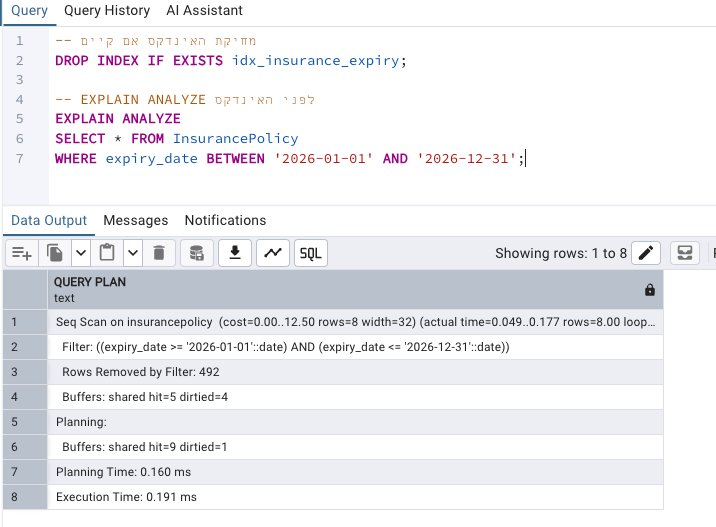

**זמן ריצה אחרי האינדקס — Bitmap Index Scan, 0.036ms:**
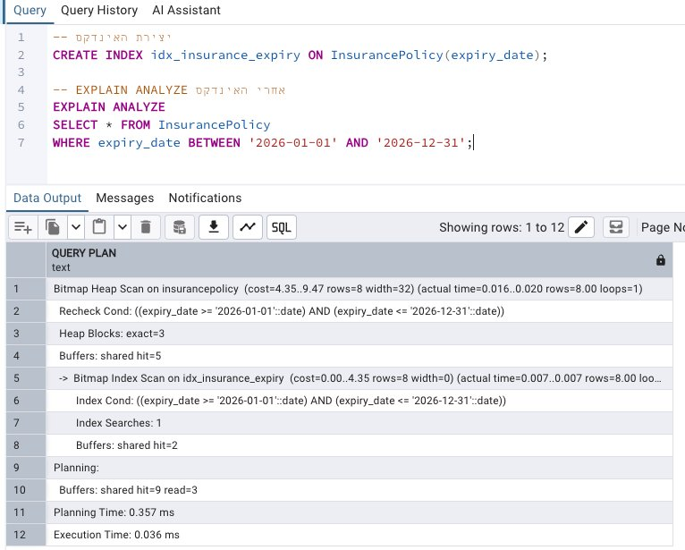

**הסבר התוצאות:**
לפני האינדקס, PostgreSQL סרק 500 שורות. אחרי האינדקס, הוא משתמש ב-Bitmap Index Scan עם 2 גישות בלבד. **שיפור של 5.3x מהיר יותר**. השיפור פחות דרמטי כי הטבלה קטנה יחסית, אבל עדיין משמעותי.

---

## סיכום ביצועי האינדקסים

| אינדקס | זמן לפני | זמן אחרי | שיפור |
|---------|----------|-----------|--------|
| idx_patient_name | 3.497 ms | 0.480 ms | **7.3x** |
| idx_appointment_date_doctor | 1.363 ms | 0.031 ms | **44x** |
| idx_insurance_expiry | 0.191 ms | 0.036 ms | **5.3x** |

ניתן לראות שאינדקסים על טבלאות גדולות (Patient, Appointment) נותנים שיפורים דרמטיים יותר מאשר על טבלאות קטנות (InsurancePolicy).
