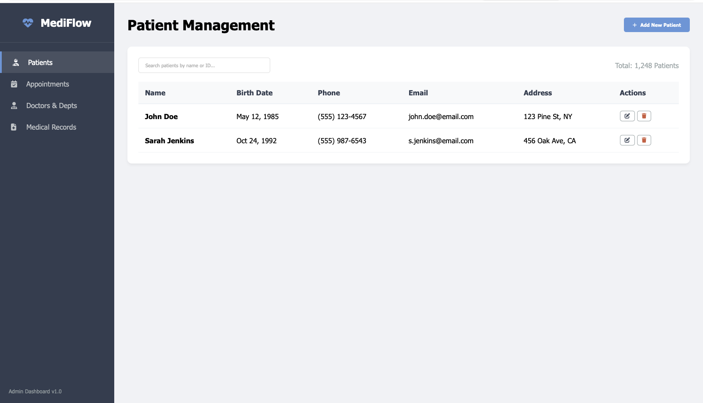
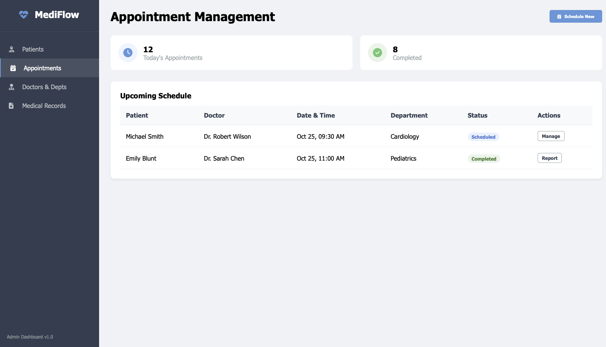
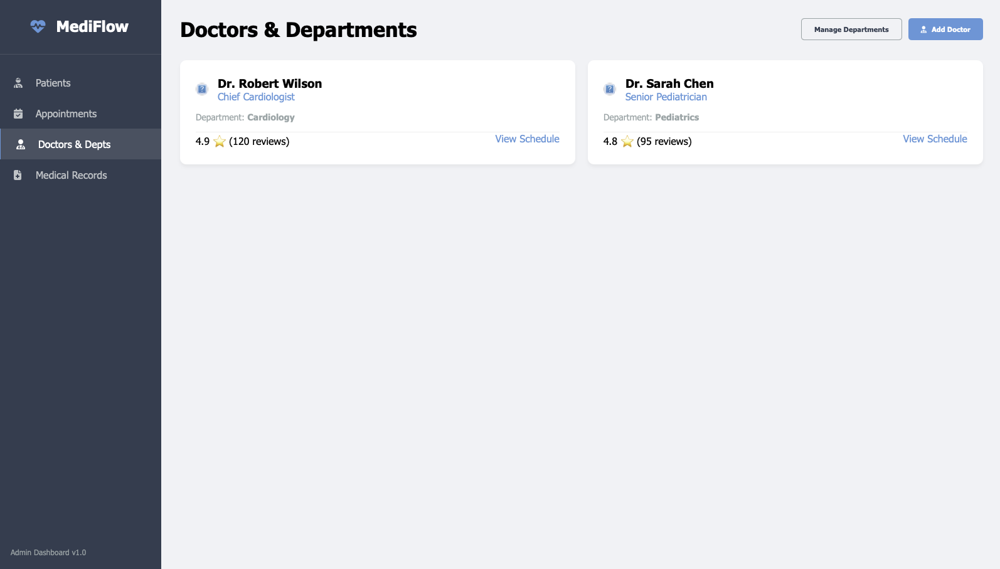
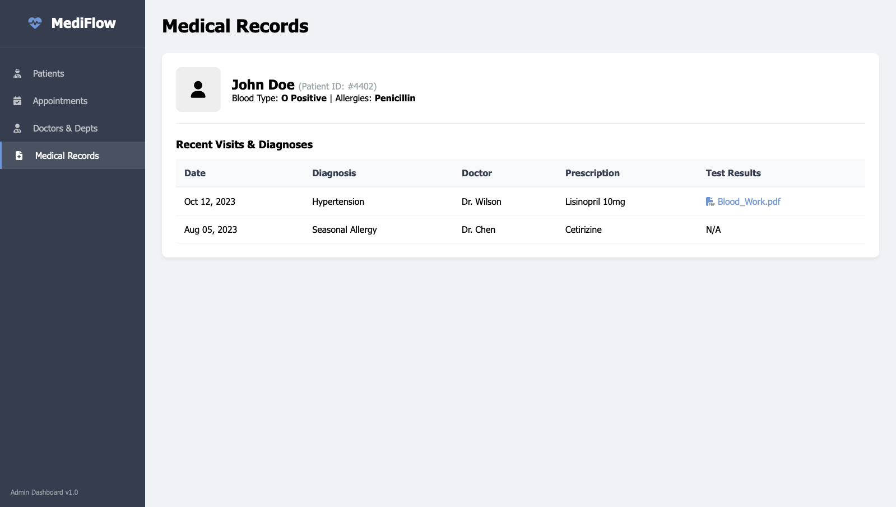
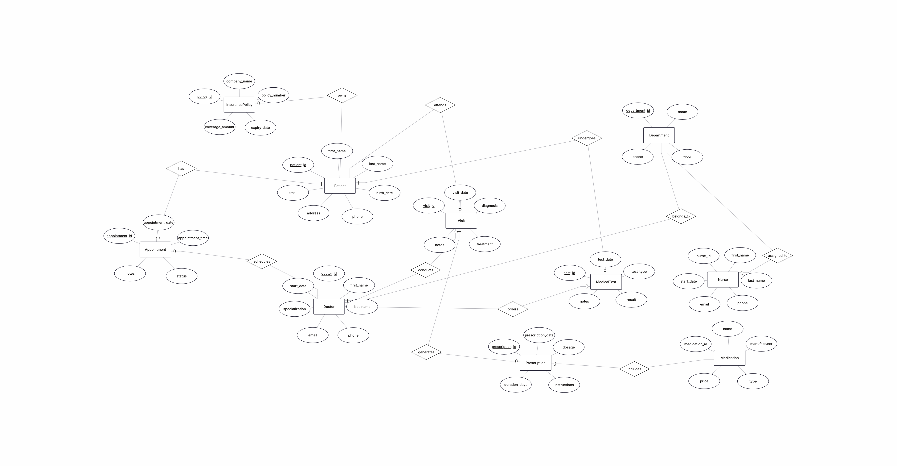
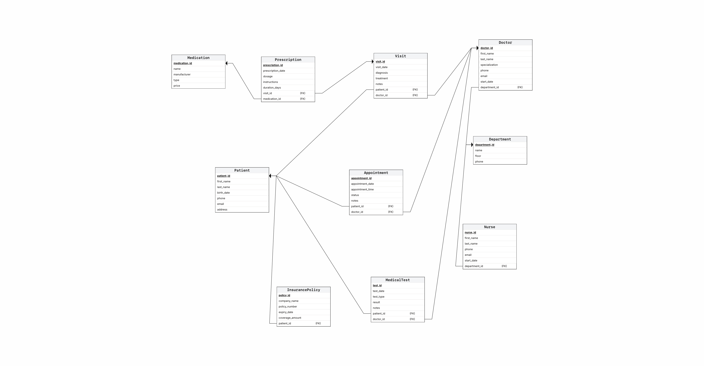
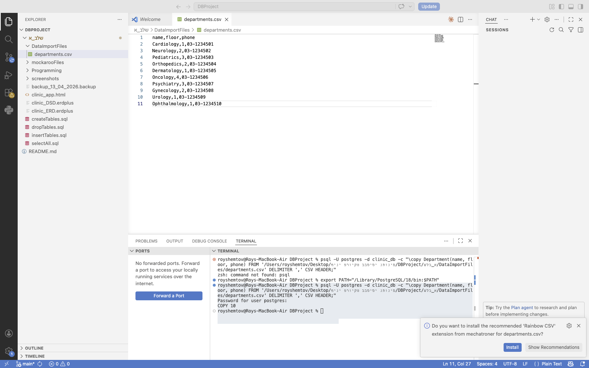
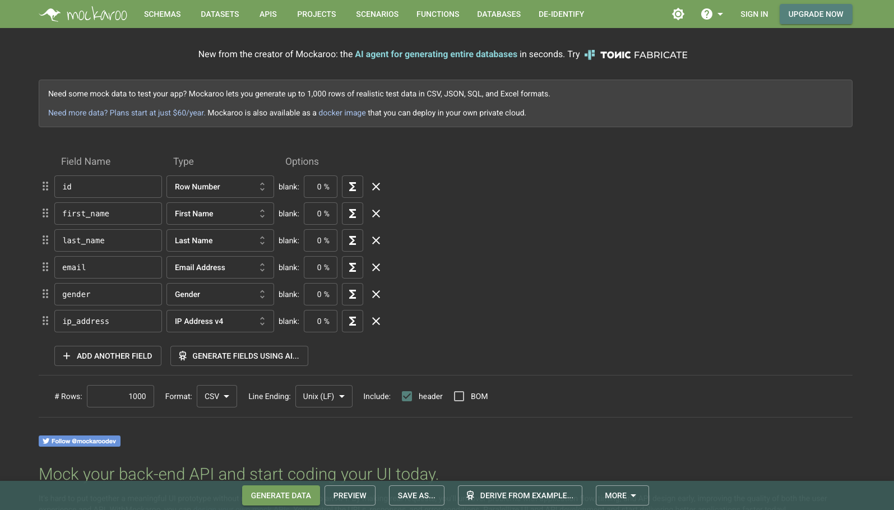
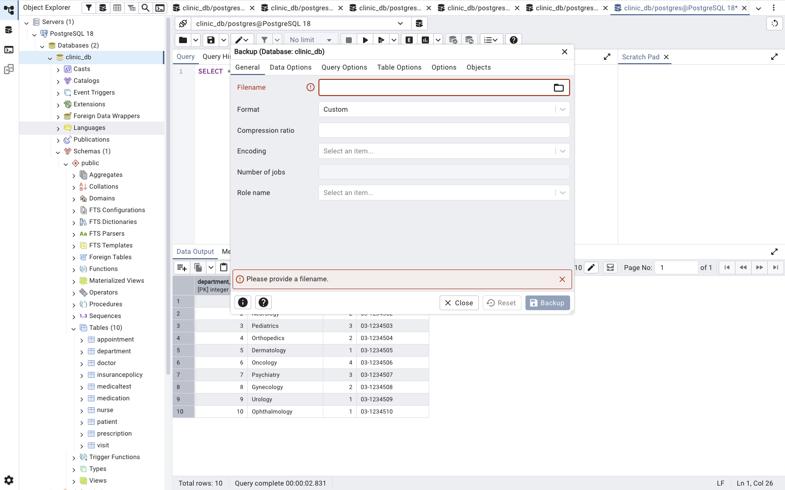

# מיני פרויקט בסיסי נתונים — קליניקה רפואית

## שער
**מגישים:** Roy Shem Tov (200042729) | Ori Winograd (331097410)
**שם המערכת:** MediFlow — מערכת ניהול קליניקה רפואית
**תאריך הגשה:** 13/04/2026

---

## תוכן עניינים
1. מבוא
2. מסכי המערכת
3. תרשים ERD
4. תרשים DSD
5. החלטות עיצוב
6. שיטות הכנסת נתונים
7. גיבוי ושחזור

---

## 1. מבוא

מערכת MediFlow היא מערכת ניהול קליניקה רפואית המאפשרת ניהול מטופלים, תורים, רופאים ורשומות רפואיות.

**הנתונים הנשמרים במערכת:**
- פרטי מטופלים (שם, תאריך לידה, טלפון, כתובת, ביטוח)
- פרטי רופאים ואחיות (שם, התמחות, מחלקה)
- ניהול תורים (תאריך, שעה, סטטוס)
- ביקורים ואבחנות רפואיות
- מרשמים ותרופות
- בדיקות רפואיות ותוצאותיהן

**הפונקציונאליות העיקרית:**
- קביעת תורים ומעקב אחר סטטוסם
- תיעוד ביקורים ואבחנות
- ניהול מרשמים ותרופות
- צפייה בתוצאות בדיקות
- ניהול ביטוחי מטופלים

---

## 2. מסכי המערכת

המסכים נוצרו בעזרת Google AI Studio.
**לינק לאפליקציה:** https://aistudio.google.com/prompts/190_XYT5-ZDsGzGkIizTEiP0bFTndEfuW

### מסך 1 — ניהול מטופלים

### מסך 2 — ניהול תורים

### מסך 3 — רופאים ומחלקות

### מסך 4 — רשומות רפואיות

---

## 3. תרשים ERD

---

## 4. תרשים DSD

---

## 5. החלטות עיצוב

**1. בחרנו קליניקה כללית** — כי יש בה הרבה ישויות טבעיות שמתחברות אחת לשנייה ומאפשרות שאילתות מעניינות.

**2. 10 ישויות במקום 6** — בחרנו יותר מהמינימום כדי להעשיר את הפרויקט ולאפשר שאילתות מורכבות יותר.

**3. הפרדנו Doctor ו-Nurse לטבלאות נפרדות** — כי לכל אחד מהם תפקיד שונה במערכת. זה גם מאפשר לנו לנהל כוח אדם בצורה מדויקת יותר.

**4. יצרנו טבלת Visit נפרדת** — במקום לשמור את האבחנה בתוך Appointment, כי ביקור מתועד הוא אירוע שונה מתור.

**5. InsurancePolicy מחוברת למטופל** — כי ביטוח שייך למטופל ספציפי ולא לביקור.

**6. שדות DATE משמעותיים** — בחרנו 6 שדות תאריך: birth_date, appointment_date, visit_date, test_date, expiry_date, start_date — כולם משמשים לשאילתות משמעותיות.

**7. נרמול 3NF** — כל מידע נשמר פעם אחת בלבד בטבלה המתאימה לו.

**8. אילוצים** — הוספנו CHECK על status בטבלת Appointment, NOT NULL על שדות חובה, ו-UNIQUE על email.

---

## 6. שיטות הכנסת נתונים

### שיטה 1 — ייבוא CSV
יובאו נתונים לטבלת Department מקובץ CSV בעזרת פקודת \copy.
הקובץ נמצא בתיקיית DataImportFiles.

### שיטה 2 — סקריפט Python
נכתב סקריפט Python שייצר 20,000 רשומות לטבלאות Patient ו-Appointment.
הקוד נמצא בתיקיית Programing.

### שיטה 3 — Mockaroo
הוכנסו נתונים דרך האתר mockaroo.com לטבלאות Nurse, Visit, Prescription, MedicalTest, InsurancePolicy.
הקבצים נמצאים בתיקיית mockarooFiles.

---

## 7. גיבוי ושחזור

בוצע גיבוי של בסיס הנתונים דרך pgAdmin.
שם קובץ הגיבוי: `backup_13_04_2026.backup`

## דוח הפרויקט - שלב ב': שאילתות ואילוצים

### חלק 1: 4 שאילתות SELECT כפולות והשוואת יעילות

**שאילתה 1: מטופלים עם תורים עתידיים לקרדיולוגיה**
* **תיאור:** השאילתה מציגה את פרטי המטופלים שיש להם תור עתידי למחלקת קרדיולוגיה, תוך חילוץ חודש התור. מתאימה למסך ניהול התורים.
* **קוד השאילתה (דרך א' היעילה - JOIN):**

  
* **הסבר על הבדלי היעילות:** דרך א' משתמשת ב-INNER JOIN, שמבוצעת על ידי מנוע ה-DB בצורה יעילה (סריקה וחיבור). דרך ב' משתמשת בתת-שאילתות מקוננות ב-IN, שלרוב דורשות יותר משאבים וסריקות חוזרות, ולכן ה-JOIN יעיל ומומלץ יותר.

**שאילתה 2: כמות ביקורים בשנה הנוכחית לרופא**
* **תיאור:** ספירה ודירוג של רופאים לפי כמות הביקורים שלהם בשנה הנוכחית. מתאים למסך הצגת עומס רופאים.
* **קוד השאילתה (דרך א' היעילה - GROUP BY):**
  

* **הסבר על הבדלי היעילות:** דרך א' מבוססת על קיבוץ (GROUP BY) ורצה על כל הטבלה בבת אחת. דרך ב' משתמשת בתת-שאילתה מקורלצת (Correlated Subquery) ב-SELECT, שמאלצת את השרת להריץ ספירה מחדש עבור כל שורת רופא, ולכן אטית משמעותית.

**שאילתה 3: ביטוחים שפגים בחודש הבא**
* **תיאור:** איתור מטופלים שפוליסת הביטוח שלהם מסתיימת בחודש הבא (להוצאת התראה למטופל).
* **קוד השאילתה (דרך א' היעילה - EXISTS):**
  

* **הסבר על הבדלי היעילות:** שימוש ב-EXISTS עוצר את הסריקה ברגע שנמצאת התאמה ראשונה למטופל (Short-circuit). שימוש ב-JOIN רגיל (דרך ב') סורק הכל ועלול להכפיל שורות למטופל עם מספר פוליסות, מה שמייקר את העיבוד.

**שאילתה 4: תרופות שניתנו מעל ל-10 פעמים**
* **תיאור:** מציאת התרופות הנפוצות ביותר שניתנו במרשמים במרפאה.
* **קוד השאילתה (דרך א' היעילה - HAVING):**
  

* **הסבר על הבדלי היעילות:** דרך א' רצה בסריקה אחת ומסננת מיד בעזרת HAVING. דרך ב' משתמשת ב-CTE (פקודת WITH) ליצירת טבלה זמנית, שבמסדי נתונים גדולים גורמת לכתיבה לדיסק ומאטה את השאילתה.

---

### חלק 2: 4 שאילתות SELECT נוספות

**שאילתה 5: היסטוריה רפואית למטופל (לפי מסך 4)**
* **תיאור:** שליפת תיק רפואי מלא למטופל ספציפי הכולל ביקורים, אבחנות ותרופות.

**שאילתה 6: בדיקות רפואיות למטופלים מעל גיל 60**
* **תיאור:** שליפת היסטוריית בדיקות רפואיות למטופלים מבוגרים, תוך חישוב גילם המדויק באמצעות פונקציית AGE.

**שאילתה 7: כמות התורים שבוטלו לפי מחלקה**
* **תיאור:** דוח המציג אילו מחלקות סובלות מהכי הרבה ביטולי תורים.
  

**שאילתה 8: ותק אחיות**
* **תיאור:** רשימת האחיות שהחלו לעבוד לפני שנת 2020 וחישוב שנות הוותק שלהן.
  

---

### חלק 3: שאילתות UPDATE

**1. עדכון סטטוס תורים שעבר זמנם**
* **תיאור:** הפיכת תורים שנקבעו לעבר לסטטוס 'completed'.
* **מצב הטבלה לפני העדכון:**

* **מצב הטבלה אחרי העדכון:**

**2. העלאת סכום כיסוי ביטוחי**
* **תיאור:** העלאת סכום הביטוח ב-10% לפוליסות של חברת Harel שמסתיימות בשנה הבאה.
* **מצב הטבלה לפני העדכון:**
 

* **מצב הטבלה אחרי העדכון:**

**3. הנחה על משככי כאבים**
* **תיאור:** הפחתת מחיר של 5% לכל התרופות מסוג 'Painkiller'.
* **מצב הטבלה לפני העדכון:**
 

* **מצב הטבלה אחרי העדכון:**

---

### חלק 4: שאילתות DELETE

**1. מחיקת תורים מבוטלים ישנים**
* **תיאור:** מחיקת תורים שבוטלו והתקיימו לפני יותר מ-3 שנים.
* **מצב הטבלה לפני העדכון:**

* **מצב הטבלה אחרי העדכון:**

**2. מחיקת מרשמים פגומים**
* **תיאור:** מחיקת מרשמים ללא משך טיפול או ללא מינון מוגדר.
* **מצב הטבלה לפני העדכון:**

* **מצב הטבלה אחרי העדכון:**

**3. מחיקת בדיקות רפואיות ללא תוצאות**
* **תיאור:** מחיקת בדיקות שבוצעו לפני יותר מחצי שנה ולא הוזנו להן תוצאות (NULL).
* **מצב הטבלה לפני העדכון:**

* **מצב הטבלה אחרי העדכון:**

---

### חלק 5: טרנזקציות (Rollback & Commit)

**דוגמת ROLLBACK:**
* **מצב התחלתי:**
 

* **ביצוע הפקודות:** ביצוע BEGIN, לאחר מכן UPDATE (עדכון שגוי להתמחות הרופא), ולאחר מכן ביצוע ROLLBACK כדי להתחרט.
* **מצב לאחר הטרנזקציה:**
 

---

### חלק 6: אילוצים (Constraints)

---

### חלק 7: אינדקסים

