# מיני פרויקט בסיסי נתונים — קליניקה רפואית

## שער
**מגישים:** Roy Shem Tov (200042729) | Ori Winograd (331097410)
**שם המערכת:** clinic_db — מערכת ניהול קליניקה רפואית
**תאריך הגשה שלב א':** 13/04/2026
**תאריך הגשה שלב ב':** 12/05/2026

---

## תוכן עניינים
1. מבוא
2. מסכי המערכת
3. תרשים ERD
4. תרשים DSD
5. החלטות עיצוב
6. שיטות הכנסת נתונים
7. גיבוי ושחזור
8. **דוח שלב ב': שאילתות, אילוצים ואינדקסים**

---

## 1. מבוא

מערכת clinic_db היא מערכת ניהול קליניקה רפואית המאפשרת ניהול מטופלים, תורים, רופאים ורשומות רפואיות.

**הנתונים הנשמרים במערכת:**
- פרטי מטופלים (שם, תאריך לידה, טלפון, כתובת, ביטוח)
- פרטי רופאים ואחיות (שם, התמחות, מחלקה)
- ניהול תורים (תאריך, שעה, סטטוס)
- ביקורים ואבחנות רפואיות
- מרשמים ותרופות
- בדיקות רפואיות ותוצאותיהן

**הפונקציונאליות העיקרית:**
- קביעת תורים ומעקב אחר סטטוסם
- תיעוד ביקורים ואבחנות
- ניהול מרשמים ותרופות
- צפייה בתוצאות בדיקות
- ניהול ביטוחי מטופלים

---

## 2. מסכי המערכת

המסכים נוצרו בעזרת Google AI Studio.
**לינק לאפליקציה:** https://aistudio.google.com/prompts/190_XYT5-ZDsGzGkIizTEiP0bFTndEfuW

### מסך 1 — ניהול מטופלים
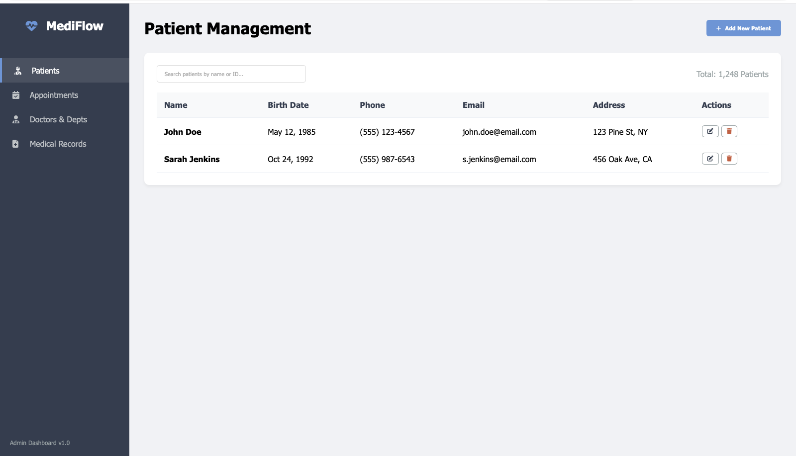

### מסך 2 — ניהול תורים
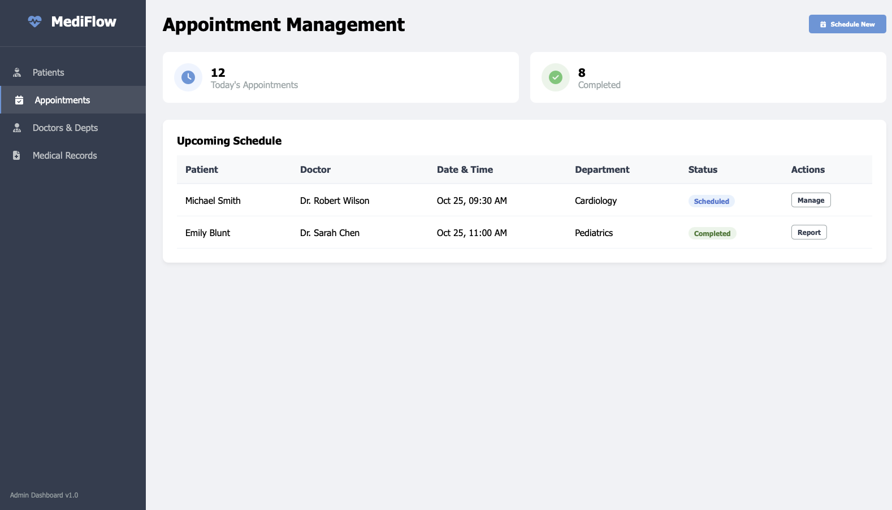

### מסך 3 — רופאים ומחלקות
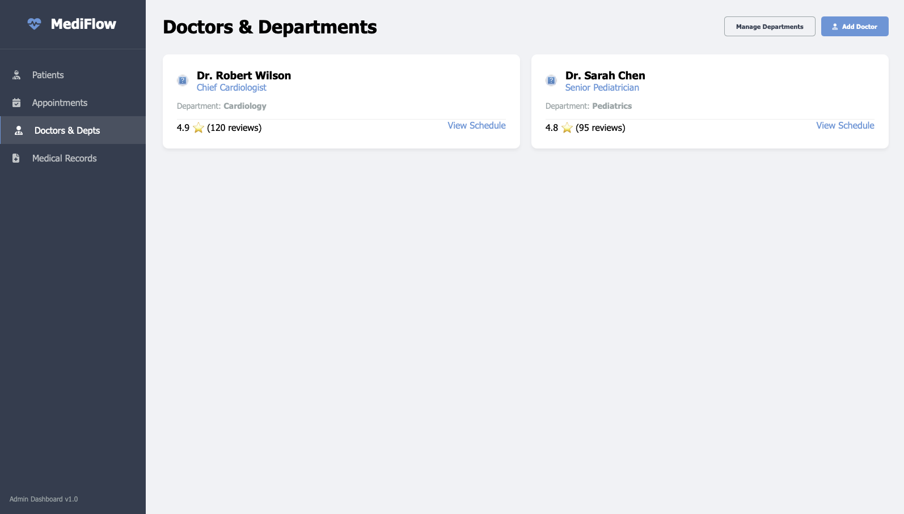

### מסך 4 — רשומות רפואיות
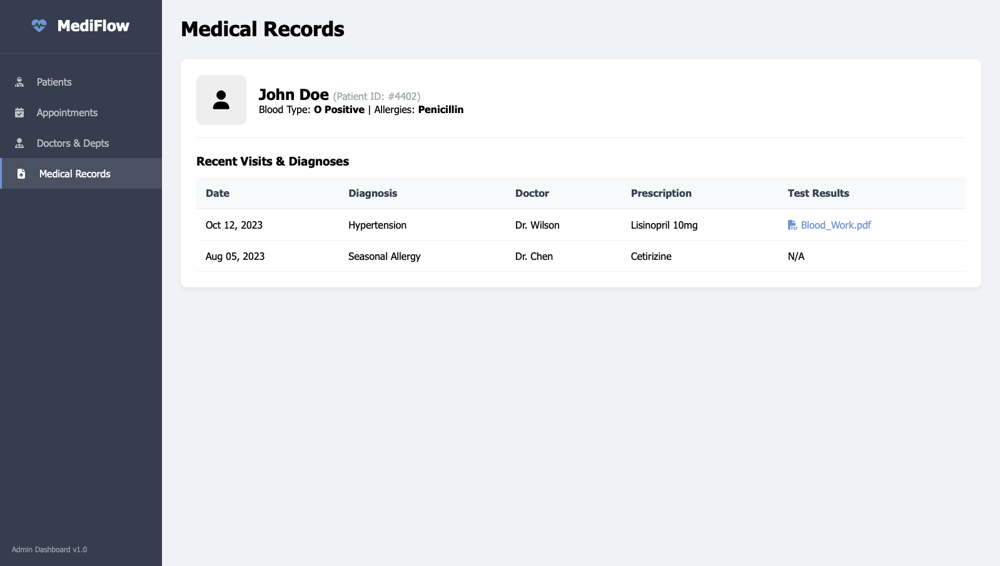

---

## 3. תרשים ERD
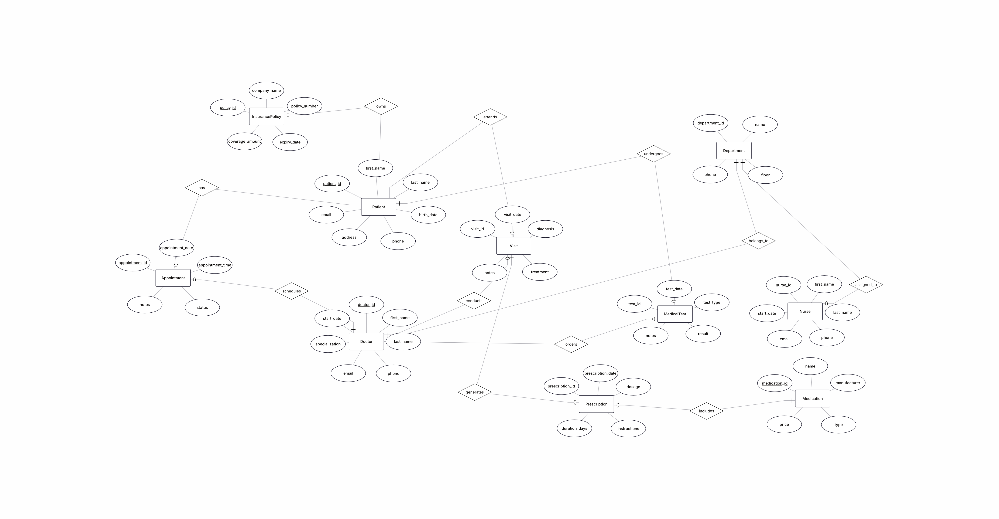

---

## 4. תרשים DSD
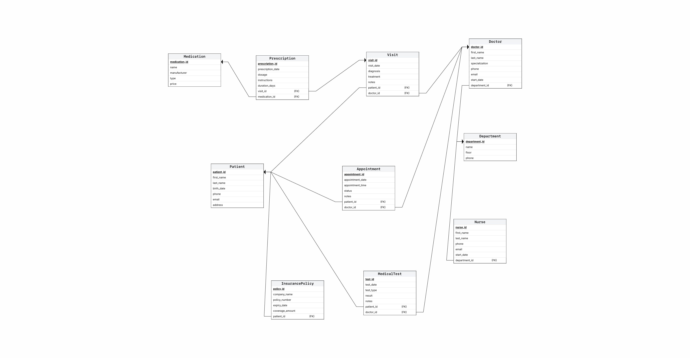

---

## 5. החלטות עיצוב

**1. בחרנו קליניקה כללית** — כי יש בה הרבה ישויות טבעיות שמתחברות אחת לשנייה ומאפשרות שאילתות מעניינות.

**2. 10 ישויות במקום 6** — בחרנו יותר מהמינימום כדי להעשיר את הפרויקט ולאפשר שאילתות מורכבות יותר.

**3. הפרדנו Doctor ו-Nurse לטבלאות נפרדות** — כי לכל אחד מהם תפקיד שונה במערכת. זה גם מאפשר לנו לנהל כוח אדם בצורה מדויקת יותר.

**4. יצרנו טבלת Visit נפרדת** — במקום לשמור את האבחנה בתוך Appointment, כי ביקור מתועד הוא אירוע שונה מתור.

**5. InsurancePolicy מחוברת למטופל** — כי ביטוח שייך למטופל ספציפי ולא לביקור.

**6. שדות DATE משמעותיים** — בחרנו 6 שדות תאריך: birth_date, appointment_date, visit_date, test_date, expiry_date, start_date — כולם משמשים לשאילתות משמעותיות.

**7. נרמול 3NF** — כל מידע נשמר פעם אחת בלבד בטבלה המתאימה לו.

**8. אילוצים** — הוספנו CHECK על status בטבלת Appointment, NOT NULL על שדות חובה, ו-UNIQUE על email.

---

## 6. שיטות הכנסת נתונים

### שיטה 1 — ייבוא CSV
יובאו נתונים לטבלת Department מקובץ CSV בעזרת פקודת \copy.
הקובץ נמצא בתיקיית DataImportFiles.
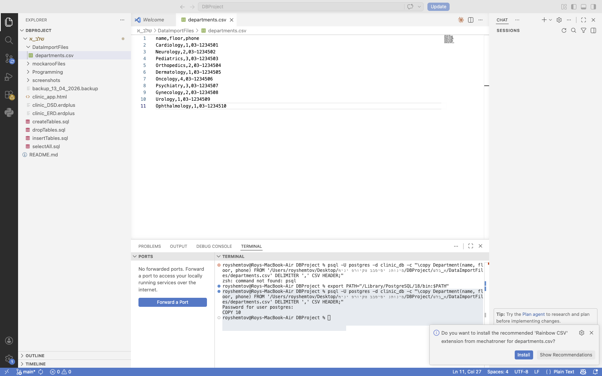

### שיטה 2 — סקריפט Python
נכתב סקריפט Python שייצר 20,000 רשומות לטבלאות Patient ו-Appointment.
הקוד נמצא בתיקיית Programing.
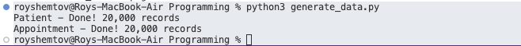

### שיטה 3 — Mockaroo
הוכנסו נתונים דרך האתר mockaroo.com לטבלאות Nurse, Visit, Prescription, MedicalTest, InsurancePolicy.
הקבצים נמצאים בתיקיית mockarooFiles.
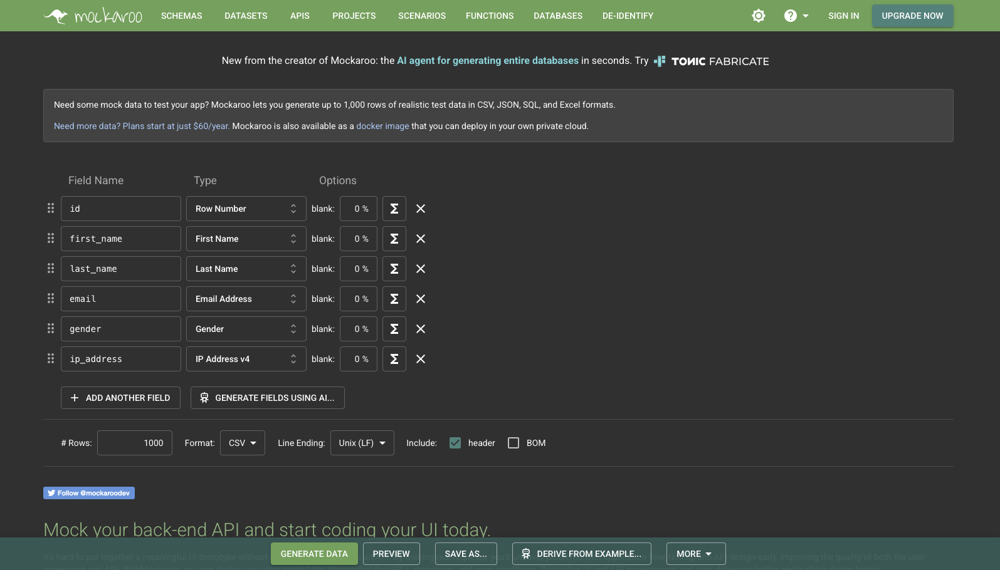

---

## 7. גיבוי ושחזור

בוצע גיבוי של בסיס הנתונים דרך pgAdmin.
שם קובץ הגיבוי: `backup_13_04_2026.backup`
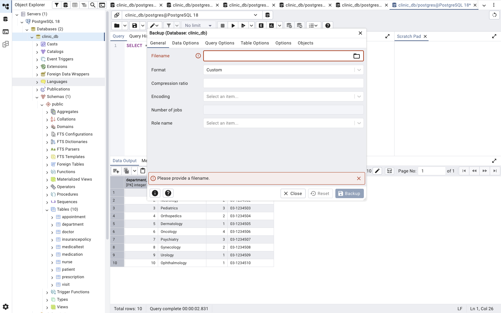

---

# 8. דוח שלב ב': שאילתות, אילוצים ואינדקסים

## הקדמה
בשלב זה ביצענו תשאול מקיף של בסיס הנתונים, כולל 8 שאילתות SELECT מורכבות, 3 שאילתות UPDATE, 3 שאילתות DELETE, הדגמות ROLLBACK ו-COMMIT, הוספת 3 אילוצים חדשים והוספת 3 אינדקסים לשיפור ביצועים.

**שינויים בטבלאות:** במהלך השלב נדרשו הוספות עמודות (ALTER TABLE) כדי לתמוך בשאילתות. השינויים תועדו בקובץ AlterTables.sql.

---

## חלק 1: 4 שאילתות SELECT כפולות (השוואת יעילות)

### שאילתה 1: מטופלים עם תורים עתידיים לקרדיולוגיה

**תיאור:** השאילתה מציגה את פרטי המטופלים שיש להם תור עתידי במחלקת קרדיולוגיה, כולל פירוק תאריך לחודש. שאילתה זו תופיע במסך ניהול תורים, לסינון מטופלים לפי מחלקה ותאריך.

**דרך א' — INNER JOIN (היעילה):**
```sql
SELECT p.first_name, p.last_name, p.phone, a.appointment_date, 
       EXTRACT(MONTH FROM a.appointment_date) as appt_month
FROM Patient p
INNER JOIN Appointment a ON p.patient_id = a.patient_id
INNER JOIN Doctor d ON a.doctor_id = d.doctor_id
INNER JOIN Department dep ON d.department_id = dep.department_id
WHERE dep.name = 'Cardiology' AND a.appointment_date > CURRENT_DATE;
```

**צילום הרצה ותוצאה:**
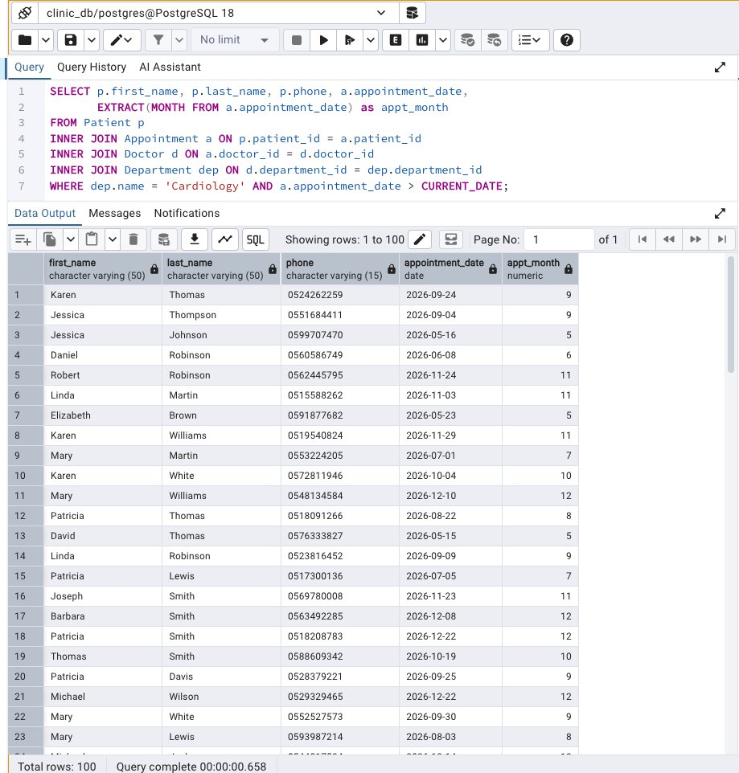

**דרך ב' — תת-שאילתות מקוננות:**
```sql
SELECT p.first_name, p.last_name, p.phone, a.appointment_date,
       EXTRACT(MONTH FROM a.appointment_date) as appt_month
FROM Patient p, Appointment a
WHERE p.patient_id = a.patient_id
  AND a.appointment_date > CURRENT_DATE
  AND a.doctor_id IN (
      SELECT doctor_id FROM Doctor WHERE department_id IN (
          SELECT department_id FROM Department WHERE name = 'Cardiology'
      )
  );
```

**צילום הרצה ותוצאה:**
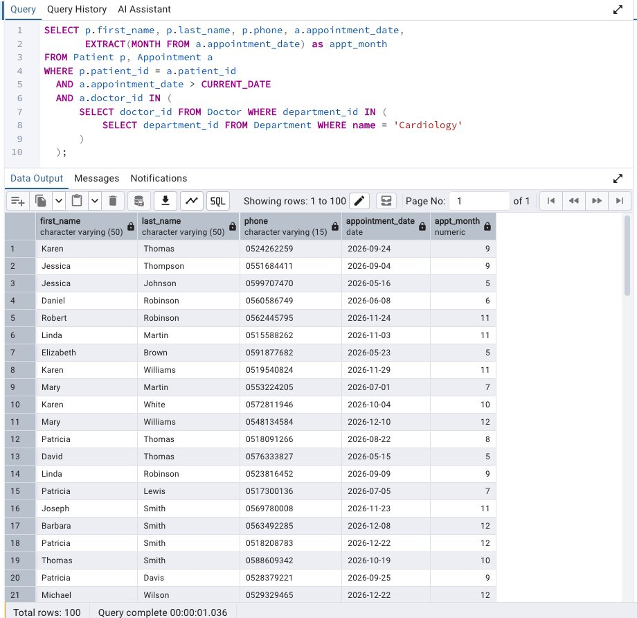

**הסבר ההבדל ביעילות:**
- **דרך א' (JOIN):** רצה בזמן של 658 מילישניות. ה-INNER JOIN מבצע חיבור יעיל בין הטבלאות תוך שימוש באלגוריתמים מוטבים של ה-DB (Hash Join או Merge Join).
- **דרך ב' (תת-שאילתות):** רצה בזמן של 1036 מילישניות. ה-DB צריך להעריך 3 תת-שאילתות מקוננות, מה שמחייב סריקות נוספות. אופטימייזר מודרני אולי יתרגם זאת ל-JOIN פנימית, אך לעיתים זה גורר תקורה נוספת.
- **JOIN יעיל יותר בכ-40%.**

---

### שאילתה 2: רשימת רופאים וכמות ביקורים בשנה הנוכחית

**תיאור:** סטטיסטיקה של מספר הביקורים לכל רופא בשנה הנוכחית. השאילתה תופיע במסך סטטיסטיקות הקליניקה.

**דרך א' — JOIN + GROUP BY (היעילה):**
```sql
SELECT d.first_name, d.last_name, dep.name AS department, COUNT(v.visit_id) as total_visits
FROM Doctor d
INNER JOIN Department dep ON d.department_id = dep.department_id
LEFT JOIN Visit v ON d.doctor_id = v.doctor_id 
  AND EXTRACT(YEAR FROM v.visit_date) = EXTRACT(YEAR FROM CURRENT_DATE)
GROUP BY d.doctor_id, d.first_name, d.last_name, dep.name
ORDER BY total_visits DESC;
```

**צילום הרצה ותוצאה:**
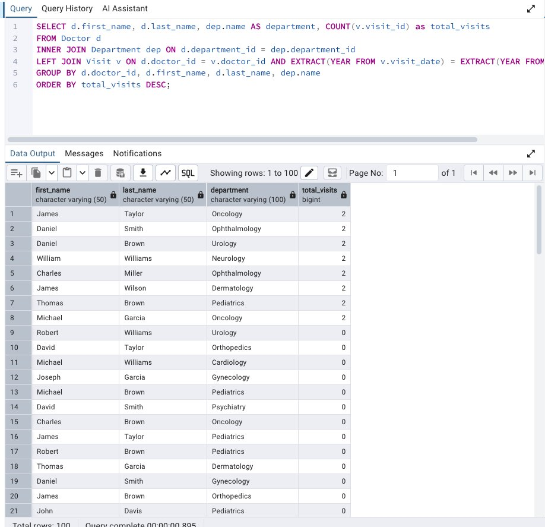

**דרך ב' — Correlated Subquery:**
```sql
SELECT d.first_name, d.last_name, 
       (SELECT name FROM Department WHERE department_id = d.department_id) AS department,
       (SELECT COUNT(*) FROM Visit v 
        WHERE v.doctor_id = d.doctor_id 
          AND EXTRACT(YEAR FROM v.visit_date) = EXTRACT(YEAR FROM CURRENT_DATE)
       ) as total_visits
FROM Doctor d
ORDER BY total_visits DESC;
```

**צילום הרצה ותוצאה:**
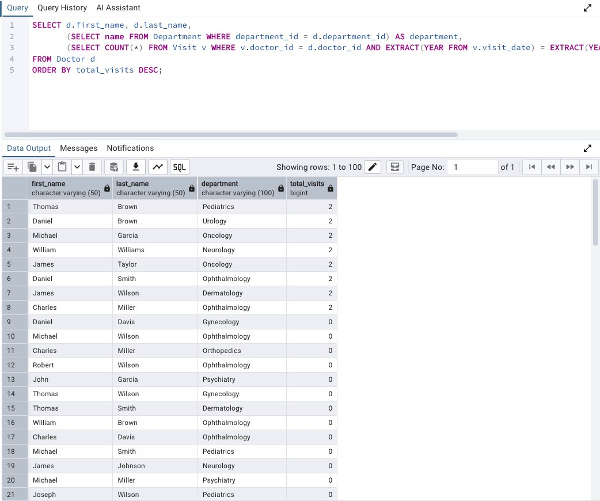

**הסבר ההבדל ביעילות:**
- **דרך א' (JOIN + GROUP BY):** רצה בזמן של 895 מילישניות. ה-DB מבצע GROUP BY פעם אחת על הטבלה המאוחדת.
- **דרך ב' (Correlated Subquery):** איטית משמעותית — לכל שורה ב-Doctor, ה-DB מבצע 2 תת-שאילתות נפרדות. אם יש 100 רופאים, זה מסתכם ב-200 תת-שאילתות.
- **JOIN יעיל יותר בעיקר ככל שמספר הרופאים גדל.**

---

### שאילתה 3: מטופלים עם פוליסות ביטוח שפג תוקפן ב-2026

**תיאור:** איתור מטופלים שפוליסת הביטוח שלהם פגה השנה (להתראה למטופל). השאילתה תופיע במסך ניהול ביטוחים.

**דרך א' — EXISTS:**
```sql
SELECT p.patient_id, p.first_name, p.last_name, p.email, p.phone
FROM Patient p
WHERE EXISTS (
    SELECT 1 
    FROM InsurancePolicy ip 
    WHERE ip.patient_id = p.patient_id 
      AND EXTRACT(YEAR FROM ip.expiry_date) = 2026
);
```

**צילום הרצה ותוצאה:**
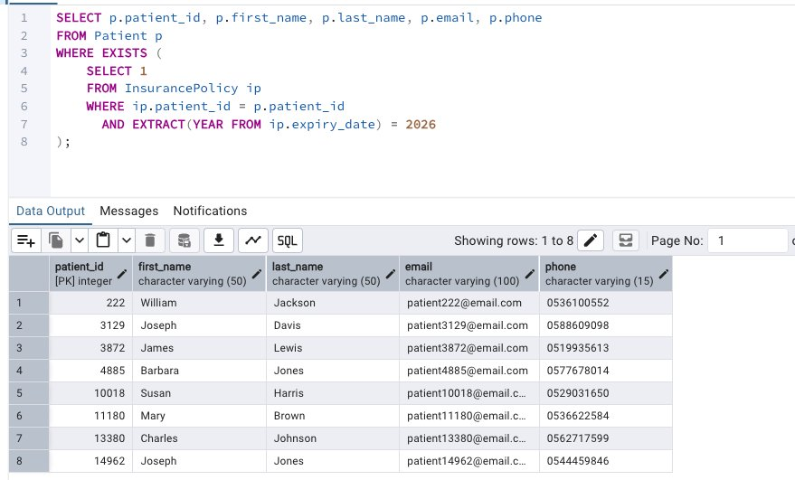

**דרך ב' — INNER JOIN עם DISTINCT:**
```sql
SELECT DISTINCT p.patient_id, p.first_name, p.last_name, p.email, p.phone
FROM Patient p
INNER JOIN InsurancePolicy ip ON p.patient_id = ip.patient_id
WHERE EXTRACT(YEAR FROM ip.expiry_date) = 2026;
```

**צילום הרצה ותוצאה:**
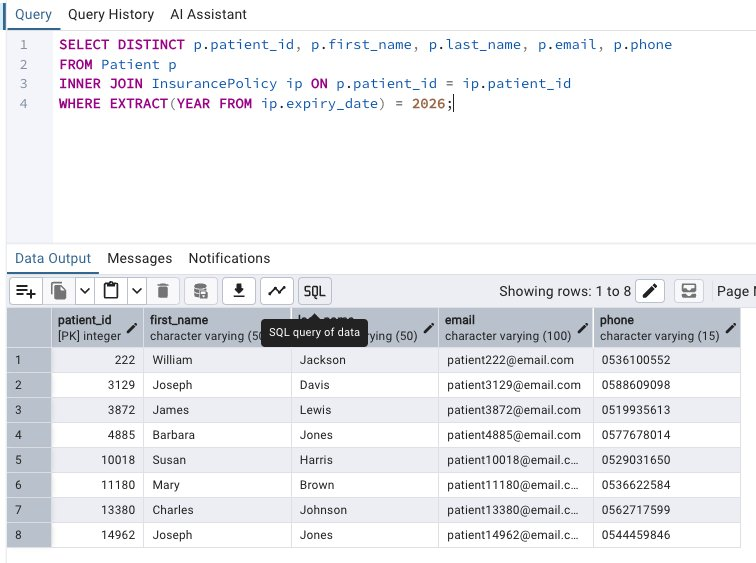

**הסבר ההבדל ביעילות:**
- **דרך א' (EXISTS):** עוצרת את הסריקה ברגע שמצאה התאמה ראשונה למטופל (Short-circuit evaluation).
- **דרך ב' (JOIN + DISTINCT):** מבצעת חיבור מלא של הטבלאות ואז מסירה כפילויות. ה-DISTINCT מוסיף שלב של מיון או הצבה.
- **EXISTS יעיל יותר כשמטופל יכול להופיע במספר פוליסות**, כי הוא לא יוצר שורות מיותרות שצריך לסנן.

---

### שאילתה 4: תרופות שנרשמו במרשמים יותר מ-10 פעמים

**תיאור:** מציאת התרופות הנפוצות במרפאה. השאילתה תופיע בדוח התרופות המנוהלות.

**דרך א' — GROUP BY + HAVING (היעילה):**
```sql
SELECT m.name, m.manufacturer, m.type, COUNT(p.prescription_id) as times_prescribed
FROM Medication m
INNER JOIN Prescription p ON m.medication_id = p.medication_id
GROUP BY m.medication_id, m.name, m.manufacturer, m.type
HAVING COUNT(p.prescription_id) > 10;
```

**צילום הרצה ותוצאה:**
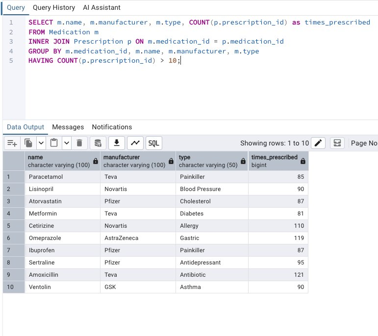

**דרך ב' — CTE (Common Table Expression):**
```sql
WITH PrescriptionCounts AS (
    SELECT medication_id, COUNT(*) as p_count
    FROM Prescription
    GROUP BY medication_id
)
SELECT m.name, m.manufacturer, m.type, pc.p_count as times_prescribed
FROM Medication m
INNER JOIN PrescriptionCounts pc ON m.medication_id = pc.medication_id
WHERE pc.p_count > 10;
```

**צילום הרצה ותוצאה:**
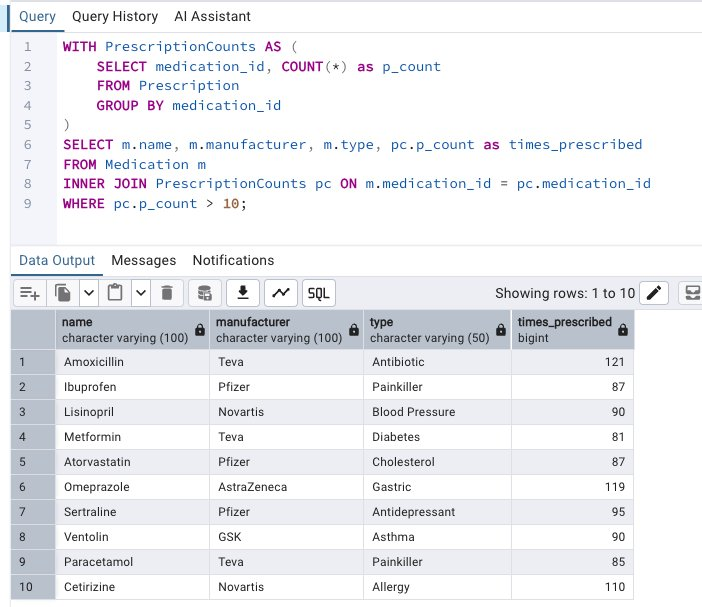

**הסבר ההבדל ביעילות:**
- **שתי הדרכים מחזירות אותן 10 תרופות בדיוק.**
- **GROUP BY + HAVING (דרך א'):** מבוצע בשלב אחד בתוך תכנון השאילתה.
- **CTE (דרך ב'):** הטבלה הזמנית נוצרת תחילה, ואז משולבת. אופטימייזר מודרני של PostgreSQL מאופטם CTE ולכן ההבדל בביצועים מינימלי במקרה זה.
- **CTE עדיף בקריאות לשאילתות מורכבות, אך GROUP BY ישיר מנצח בסיטואציות פשוטות.**

---

## חלק 2: 4 שאילתות SELECT נוספות

### שאילתה 5: היסטוריה רפואית מלאה למטופל

**תיאור:** שליפת תיק רפואי מלא של מטופל ספציפי (כולל ביקורים, אבחנות, רופאים ומרשמים). תופיע במסך תיק רפואי של מטופל.

```sql
SELECT p.first_name || ' ' || p.last_name AS patient_name, 
       v.visit_date, EXTRACT(YEAR FROM v.visit_date) as visit_year, 
       v.diagnosis, d.last_name AS doctor_name, m.name AS medication_prescribed
FROM Patient p
INNER JOIN Visit v ON p.patient_id = v.patient_id
INNER JOIN Doctor d ON v.doctor_id = d.doctor_id
LEFT JOIN Prescription pr ON v.visit_id = pr.visit_id
LEFT JOIN Medication m ON pr.medication_id = m.medication_id
WHERE p.patient_id = 4905 
ORDER BY v.visit_date DESC;
```

**צילום הרצה ותוצאה:**
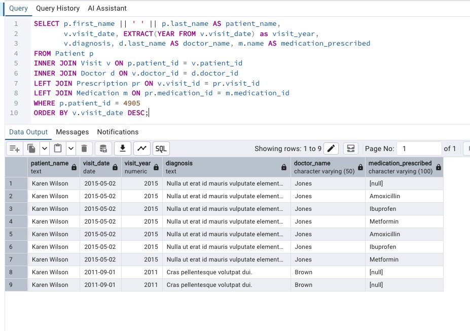

---

### שאילתה 6: בדיקות רפואיות למטופלים מעל גיל 60

**תיאור:** שליפת בדיקות עבור מטופלים מבוגרים. תופיע במסך דוחות לאוכלוסיות יעד.

```sql
SELECT mt.test_date, mt.test_type, mt.result, p.first_name, p.last_name, 
       EXTRACT(YEAR FROM AGE(CURRENT_DATE, p.birth_date)) AS age
FROM MedicalTest mt
INNER JOIN Patient p ON mt.patient_id = p.patient_id
WHERE EXTRACT(YEAR FROM AGE(CURRENT_DATE, p.birth_date)) > 60
ORDER BY mt.test_date DESC;
```

**צילום הרצה ותוצאה:**
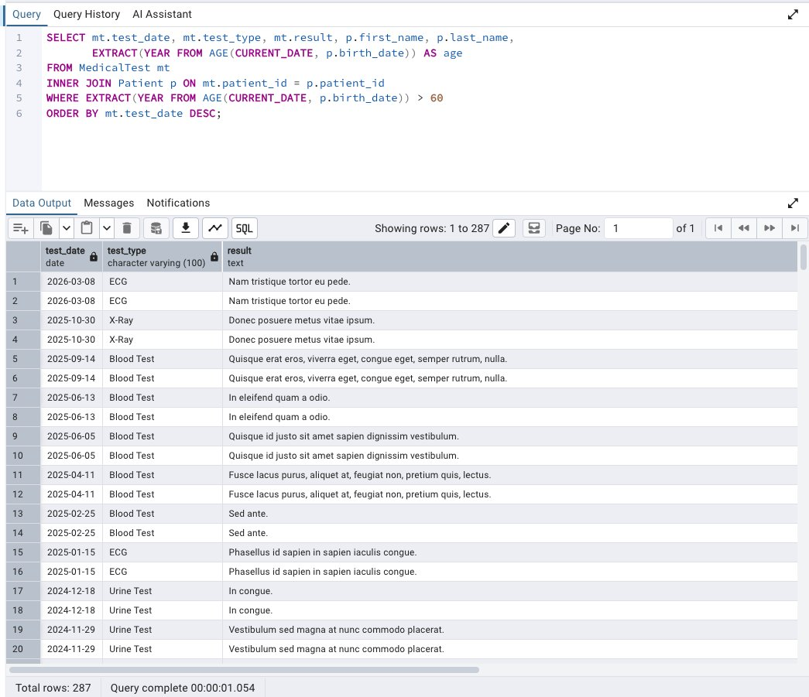

---

### שאילתה 7: כמות תורים שבוטלו לפי מחלקה וקומה

**תיאור:** דוח המציג אילו מחלקות סובלות מהכי הרבה ביטולי תורים, כולל קומה. תופיע במסך סטטיסטיקות.

```sql
SELECT dep.name AS department_name, 
       dep.floor AS department_floor,
       COUNT(a.appointment_id) AS cancelled_appointments
FROM Appointment a
INNER JOIN Doctor d ON a.doctor_id = d.doctor_id
INNER JOIN Department dep ON d.department_id = dep.department_id
WHERE a.status = 'cancelled'
GROUP BY dep.name, dep.floor
ORDER BY cancelled_appointments DESC;
```

**צילום הרצה ותוצאה:**
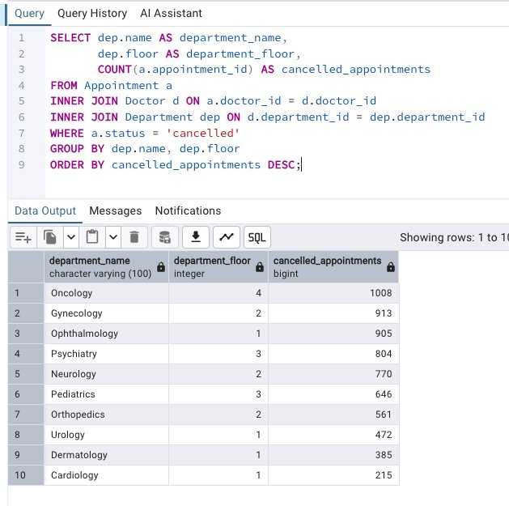

---

### שאילתה 8: אחיות ותיקות עם פרטי מחלקתן

**תיאור:** רשימת האחיות שהחלו לעבוד לפני 2020, כולל המחלקה שלהן ושנות הוותק. תופיע במסך ניהול כוח אדם.

```sql
SELECT n.first_name, n.last_name, n.email, dep.name AS department_name, 
       n.start_date, EXTRACT(YEAR FROM AGE(CURRENT_DATE, n.start_date)) as years_of_service
FROM Nurse n
INNER JOIN Department dep ON n.department_id = dep.department_id
WHERE EXTRACT(YEAR FROM n.start_date) < 2020
ORDER BY years_of_service DESC;
```

**צילום הרצה ותוצאה:**
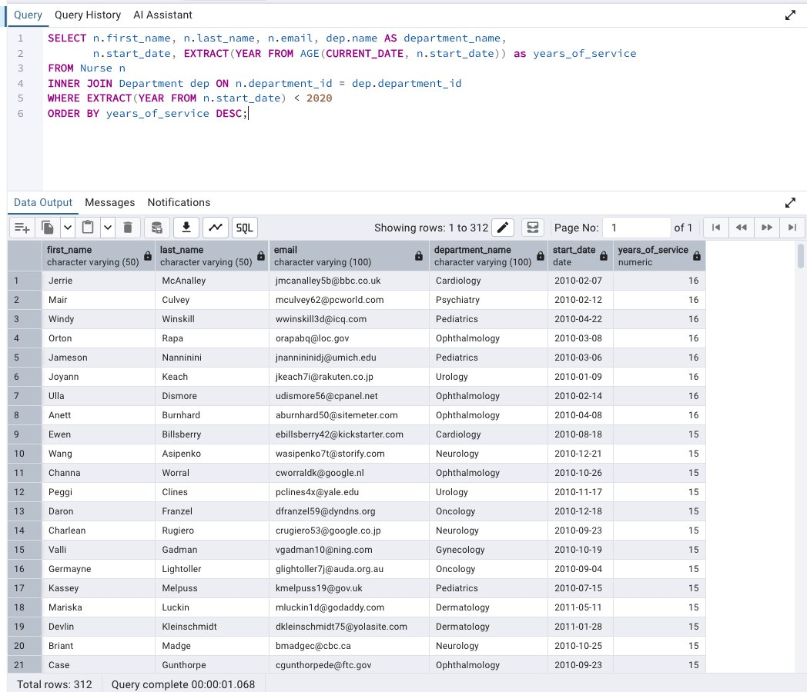

---

## חלק 3: שאילתות UPDATE

### UPDATE 1: עדכון סטטוס תורים שעבר זמנם

**תיאור:** הפיכת תורים שתאריכם עבר (status='scheduled' ולא נוכחו) לסטטוס 'completed' אוטומטית, עם תיוג בהערות.

```sql
UPDATE Appointment 
SET status = 'completed', 
    notes = COALESCE(notes, '') || ' (System updated)' 
WHERE appointment_date < CURRENT_DATE 
  AND status = 'scheduled';
```

**מצב לפני העדכון:**
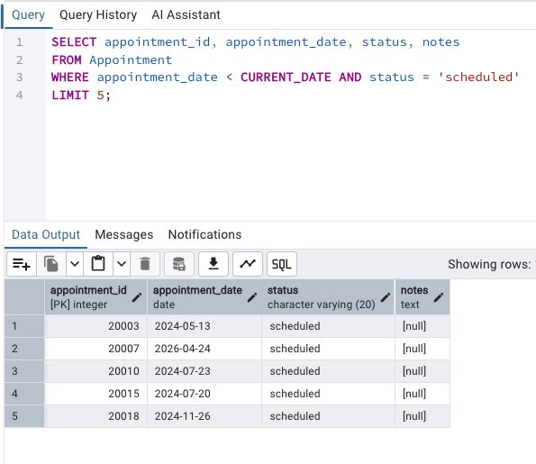

**הרצת UPDATE — 5,720 שורות עודכנו:**
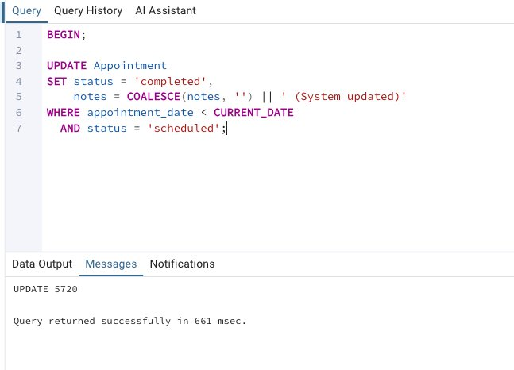

**מצב אחרי העדכון:**
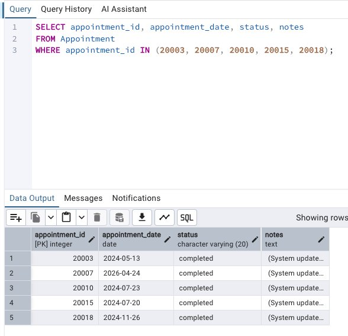

---

### UPDATE 2: העלאת סכום הכיסוי הביטוחי ב-10% לפוליסות 2026

**תיאור:** מתן הטבה למטופלים שפוליסת ביטוחם תפוג השנה - העלאה אוטומטית של 10% בכיסוי.

```sql
UPDATE InsurancePolicy 
SET coverage_amount = coverage_amount * 1.10 
WHERE EXTRACT(YEAR FROM expiry_date) = 2026;
```

**מצב לפני העדכון:**
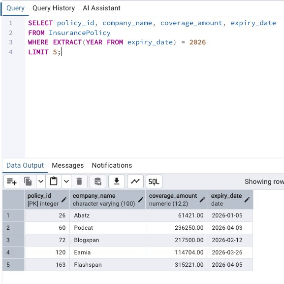

**הרצת UPDATE — 8 שורות עודכנו:**
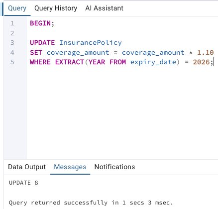

**מצב אחרי העדכון:** (סכומים גדלו ב-10%)
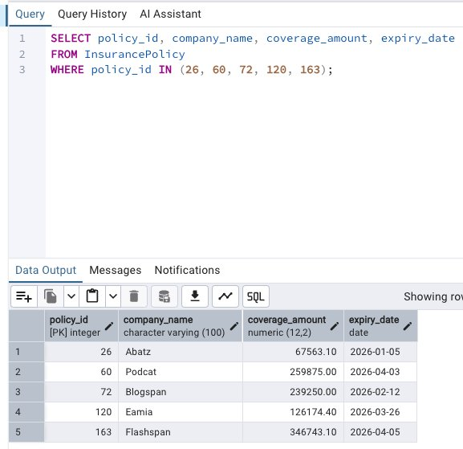

---

### UPDATE 3: הנחה של 5% על משככי כאבים

**תיאור:** מבצע הנחה זמנית על משככי כאבים. הפחתת מחיר ב-5% לכל התרופות מסוג 'Painkiller'.

```sql
UPDATE Medication 
SET price = price * 0.95 
WHERE type = 'Painkiller';
```

**מצב לפני העדכון:** (Ibuprofen: 15.00, Paracetamol: 10.00)
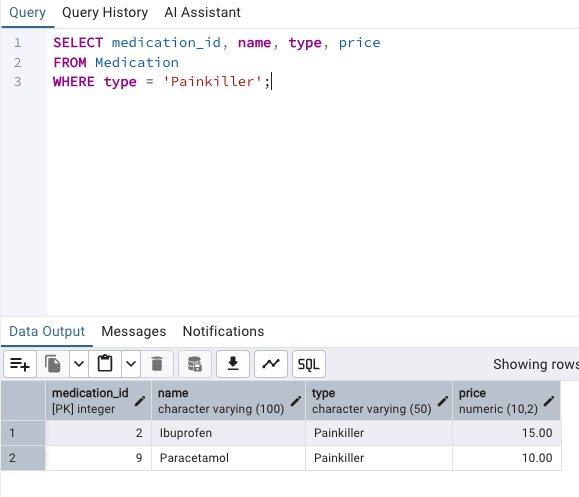

**הרצת UPDATE — 2 שורות עודכנו:**
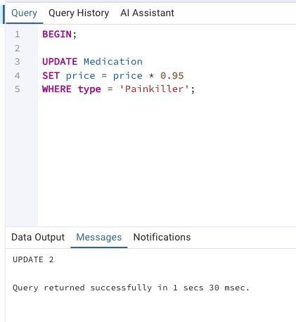

**מצב אחרי העדכון:** (Ibuprofen: 14.25, Paracetamol: 9.50)
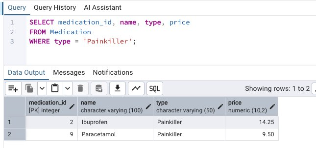

---

## חלק 4: שאילתות DELETE

### DELETE 1: מחיקת תורים מבוטלים ישנים

**תיאור:** ניקוי תורים שבוטלו לפני 2024 כדי לשמור על הטבלה רזה.

```sql
DELETE FROM Appointment 
WHERE status = 'cancelled' 
  AND appointment_date < '2024-01-01';
```

**מצב לפני המחיקה — 1,657 שורות עומדות להימחק:**
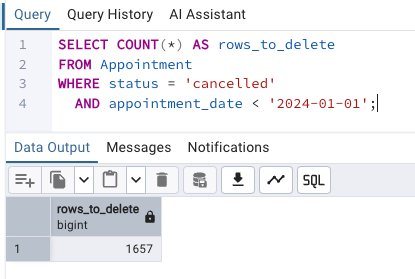

**הרצת DELETE — 1,657 שורות נמחקו:**
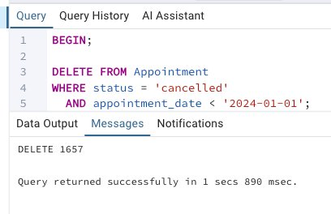

**מצב אחרי המחיקה — 0 שורות נשארו:**
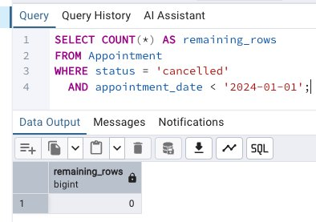

---

### DELETE 2: מחיקת מרשמים ישנים מאוד

**תיאור:** ניקוי מרשמים שניתנו לפני 2013 - הם כבר לא רלוונטיים רפואית.

```sql
DELETE FROM Prescription 
WHERE prescription_date < '2013-01-01';
```

**מצב לפני המחיקה — 177 שורות עומדות להימחק:**
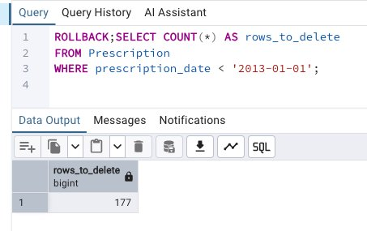

**הרצת DELETE — 177 שורות נמחקו:**
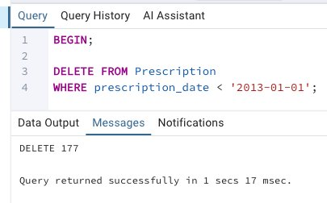

**מצב אחרי המחיקה — 0 שורות נשארו:**
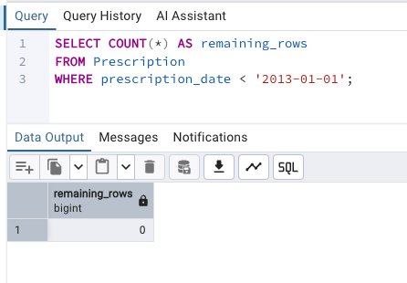

---

### DELETE 3: מחיקת בדיקות רפואיות ישנות

**תיאור:** ניקוי בדיקות רפואיות מלפני 2015 - מעבר לתקופת השמירה הנדרשת.

```sql
DELETE FROM MedicalTest 
WHERE test_date < '2015-01-01';
```

**מצב לפני המחיקה — 332 שורות עומדות להימחק:**
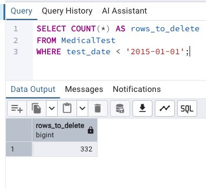

**הרצת DELETE — 332 שורות נמחקו:**
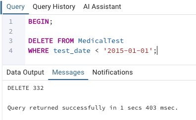

**מצב אחרי המחיקה — 0 שורות נשארו:**
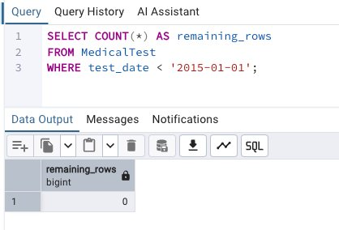

---

## חלק 5: ROLLBACK ו-COMMIT

### דוגמת ROLLBACK
הדגמה של ביטול שינוי בעזרת ROLLBACK. נשנה בטעות התמחות רופא מספר 1, ונבטל את השינוי.

```sql
-- מצב 1: לפני השינוי
SELECT doctor_id, specialization FROM Doctor WHERE doctor_id = 1;

BEGIN;
-- שינוי בטעות
UPDATE Doctor SET specialization = 'Unknown' WHERE doctor_id = 1;

-- מצב 2: השינוי קרה בתוך הטרנזקציה
SELECT doctor_id, specialization FROM Doctor WHERE doctor_id = 1;

ROLLBACK;
-- מצב 3: הטרנזקציה בוטלה, הנתונים חזרו
SELECT doctor_id, specialization FROM Doctor WHERE doctor_id = 1;
```

**מצב 1 — לפני (specialization = Gynecology):**
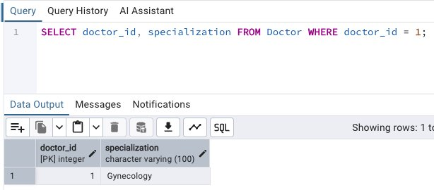

**מצב 2 — אחרי UPDATE בתוך הטרנזקציה (specialization = Unknown):**
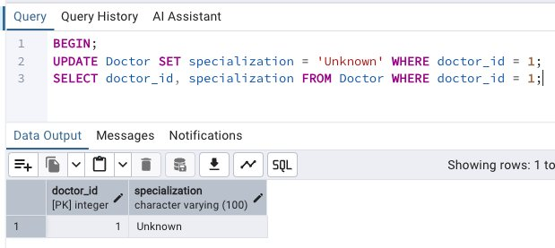

**מצב 3 — אחרי ROLLBACK (specialization חזר ל-Gynecology):**
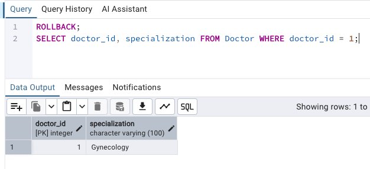

---

### דוגמת COMMIT
הדגמה של שמירת שינוי לתמיד בעזרת COMMIT. נבטל תור מספר 20003.

```sql
-- מצב 1: לפני השינוי
SELECT appointment_id, status FROM Appointment WHERE appointment_id = 20003;

BEGIN;
-- שינוי
UPDATE Appointment SET status = 'cancelled' WHERE appointment_id = 20003;

-- מצב 2: השינוי קרה בתוך הטרנזקציה
SELECT appointment_id, status FROM Appointment WHERE appointment_id = 20003;

COMMIT;
-- מצב 3: השינוי נשמר לתמיד
SELECT appointment_id, status FROM Appointment WHERE appointment_id = 20003;
```

**מצב 1 — לפני (status = scheduled):**
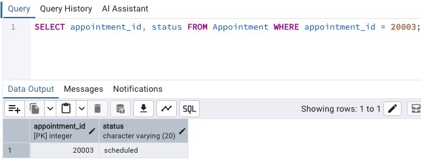

**מצב 2 — אחרי UPDATE בתוך הטרנזקציה (status = cancelled):**
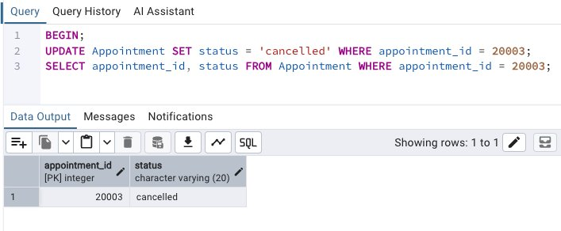

**מצב 3 — אחרי COMMIT (status נשמר כ-cancelled):**
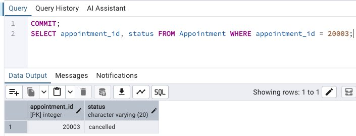

---

## חלק 6: אילוצים חדשים (Constraints)

הוספנו 3 אילוצי CHECK חדשים, כל אחד אוכף תקינות נתונים שונה. עבור כל אילוץ, ניסינו להפר אותו ב-INSERT/UPDATE מכוון, וראינו ש-PostgreSQL חוסם את הפעולה עם שגיאת constraint violation.

### אילוץ 1: תאריך לידה לא יכול להיות בעתיד

**מוטיבציה:** אדם לא יכול להיוולד בעתיד. ללא אילוץ, נתונים שגויים יכולים לחדור למערכת.

**תועלת:** מבטיח שכל מטופל במערכת קיים פיזית כיום.

```sql
ALTER TABLE Patient DROP CONSTRAINT IF EXISTS chk_patient_birth_date;
ALTER TABLE Patient ADD CONSTRAINT chk_patient_birth_date 
    CHECK (birth_date <= CURRENT_DATE);
```

**ניסיון הפרה — שגיאה כצפוי:**
```sql
INSERT INTO Patient (first_name, last_name, birth_date) 
VALUES ('Future', 'Person', '2050-01-01');
```

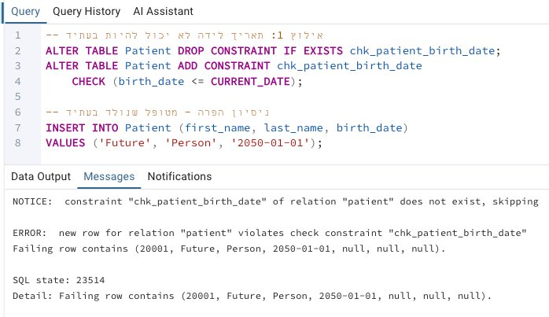

---

### אילוץ 2: שעת תור חייבת להיות בין 08:00 ל-20:00

**מוטיבציה:** הקליניקה פועלת בשעות מוגדרות. תורים מחוץ לשעות פעילות אינם תקפים.

**תועלת:** מונע יצירת תורים שגויים בלילה או מוקדם בבוקר.

```sql
ALTER TABLE Appointment DROP CONSTRAINT IF EXISTS chk_appointment_time;
ALTER TABLE Appointment ADD CONSTRAINT chk_appointment_time 
    CHECK (appointment_time >= '08:00:00' AND appointment_time <= '20:00:00');
```

**ניסיון הפרה — שגיאה כצפוי:**
```sql
INSERT INTO Appointment (appointment_date, appointment_time, status, patient_id, doctor_id) 
VALUES ('2026-12-01', '23:00:00', 'scheduled', 1, 1);
```

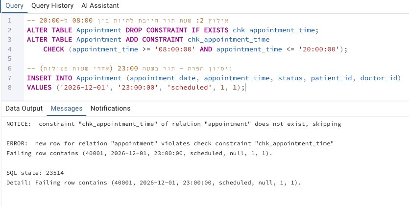

---

### אילוץ 3: מחיר תרופה חייב להיות חיובי

**מוטיבציה:** מחירים שליליים אינם הגיוניים מבחינה עסקית.

**תועלת:** מונע טעויות הזנה ושגיאות חישוב כספיות.

```sql
ALTER TABLE Medication DROP CONSTRAINT IF EXISTS chk_medication_price;
ALTER TABLE Medication ADD CONSTRAINT chk_medication_price 
    CHECK (price >= 0);
```

**ניסיון הפרה — שגיאה כצפוי:**
```sql
UPDATE Medication SET price = -100 WHERE medication_id = 1;
```

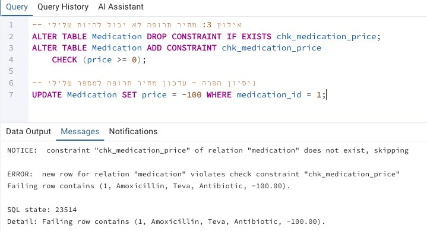

---

## חלק 7: אינדקסים (Indexes)

הוספנו 3 אינדקסים על עמודות שמשמשות בשאילתות תכופות. עבור כל אינדקס מדדנו את זמן הביצוע לפני ואחרי בעזרת `EXPLAIN ANALYZE`.

### אינדקס 1: idx_patient_name

**מוטיבציה:** חיפושים בשם המטופל (last_name + first_name) הם מאוד נפוצים — בכל פנייה של מטופל לקבלה צריך לחפש אותו לפי השם.

**תועלת:** האצת חיפושים בטבלת Patient (20,000 רשומות).

```sql
DROP INDEX IF EXISTS idx_patient_name;
CREATE INDEX idx_patient_name ON Patient(last_name, first_name);
```

**זמן ריצה לפני האינדקס — Seq Scan, 3.497ms:**
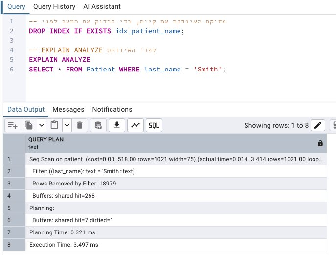

**זמן ריצה אחרי האינדקס — Bitmap Index Scan, 0.480ms:**
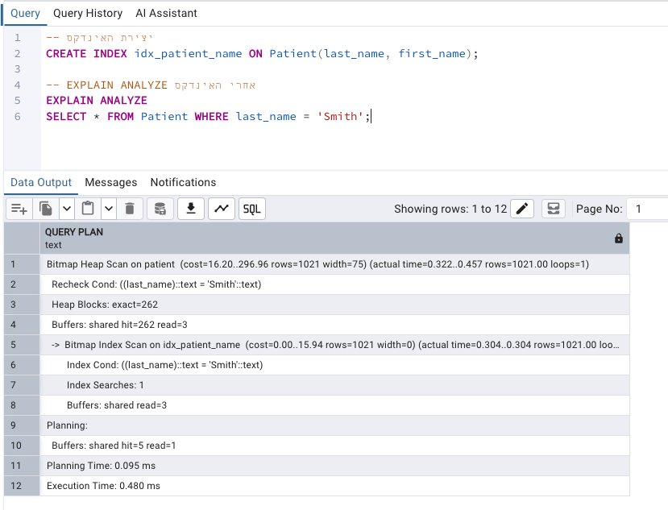

**הסבר התוצאות:** 
לפני האינדקס, PostgreSQL ביצע Seq Scan וסרק את כל 20,000 השורות בטבלה, מסיר 18,979 שורות לא תואמות. אחרי האינדקס, השימוש ב-Bitmap Index Scan מאפשר להגיע ישירות לרשומות התואמות. **שיפור של 7.3x מהיר יותר.**

---

### אינדקס 2: idx_appointment_date_doctor

**מוטיבציה:** השאלה "אילו תורים יש לרופא X בתאריך Y" היא הבסיסית ביותר במערכת לוחות זמנים של קליניקה.

**תועלת:** האצת חיפוש תורים ספציפיים בטבלת Appointment (20,000 רשומות).

```sql
DROP INDEX IF EXISTS idx_appointment_date_doctor;
CREATE INDEX idx_appointment_date_doctor ON Appointment(appointment_date, doctor_id);
```

**זמן ריצה לפני האינדקס — Seq Scan, 1.363ms:**
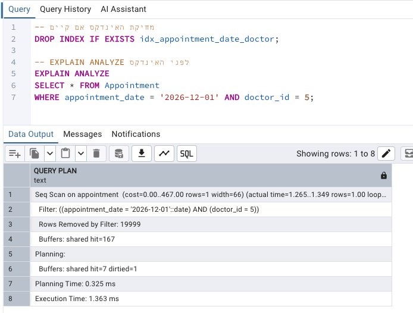

**זמן ריצה אחרי האינדקס — Index Scan, 0.031ms:**
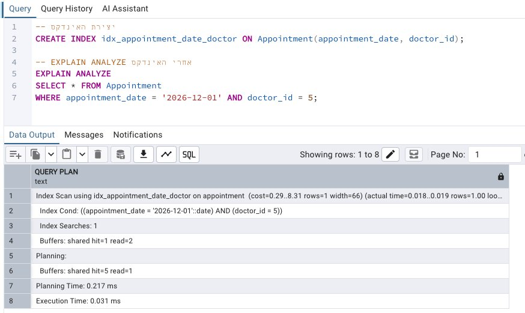

**הסבר התוצאות:**
לפני האינדקס, PostgreSQL ביצע Seq Scan וסרק 20,000 שורות. אחרי האינדקס, ה-Index Scan מאפשר לקפוץ ישירות לשורה הרצויה. **שיפור של 44x מהיר יותר** — זה השיפור הדרמטי ביותר משלושת האינדקסים, כי מדובר בטבלה גדולה עם תנאי מאוד ספציפי.

---

### אינדקס 3: idx_insurance_expiry

**מוטיבציה:** בדיקת פוליסות שעומדות לפוג היא פעולה חיונית למחלקת ביטוח.

**תועלת:** האצת שאילתות על טווחי תאריכים בטבלת InsurancePolicy.

```sql
DROP INDEX IF EXISTS idx_insurance_expiry;
CREATE INDEX idx_insurance_expiry ON InsurancePolicy(expiry_date);
```

**זמן ריצה לפני האינדקס — Seq Scan, 0.191ms:**
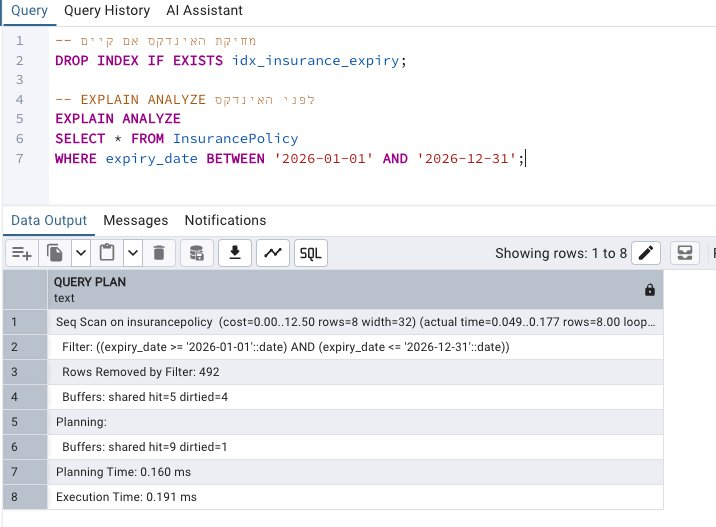

**זמן ריצה אחרי האינדקס — Bitmap Index Scan, 0.036ms:**
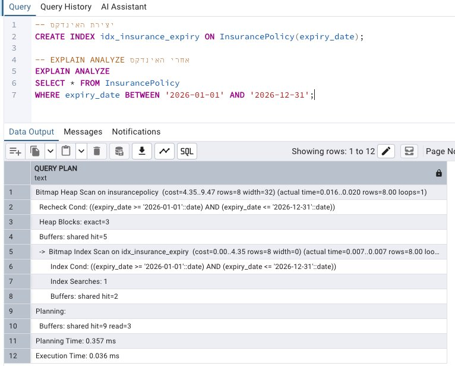

**הסבר התוצאות:**
לפני האינדקס, PostgreSQL סרק 500 שורות. אחרי האינדקס, הוא משתמש ב-Bitmap Index Scan עם 2 גישות בלבד. **שיפור של 5.3x מהיר יותר**. השיפור פחות דרמטי כי הטבלה קטנה יחסית, אבל עדיין משמעותי.

---

## סיכום ביצועי האינדקסים

| אינדקס | זמן לפני | זמן אחרי | שיפור |
|---------|----------|-----------|--------|
| idx_patient_name | 3.497 ms | 0.480 ms | **7.3x** |
| idx_appointment_date_doctor | 1.363 ms | 0.031 ms | **44x** |
| idx_insurance_expiry | 0.191 ms | 0.036 ms | **5.3x** |

ניתן לראות שאינדקסים על טבלאות גדולות (Patient, Appointment) נותנים שיפורים דרמטיים יותר מאשר על טבלאות קטנות (InsurancePolicy).
## שלב ג - אינטגרציה ומבטים

### מבוא ותיאור תהליך ההנדסה לאחור (Reverse Engineering)
קיבלנו את בסיס הנתונים של הצוות השותף העוסק ב"בניית מוסדות רפואה". על מנת להבין את מבנה הנתונים שלהם ולבצע אינטגרציה, ניתחנו את הטבלאות והאילוצים והפעלנו אלגוריתם הנדסה לאחור:
1. **זיהוי ישויות חזקות:** טבלאות עצמאיות בעלות מפתח ראשי ייחודי כגון `medical_institution` ו-`project` הוגדרו כישויות מרכזיות.
2. **זיהוי ירושה (IS-A):** זיהינו כי הטבלאות `finance_manager` ו-`project_manager` חולקות את אותו מפתח ראשי `member_id` המפנה לטבלת `staff_member`. לפיכך, הגדרנו מבנה ירושה שבו אנשי הצוות הם ישות אב ומנהלי הפרויקטים/כספים הם ישויות בן.
3. **זיהוי ישויות חלשות וקשרי M:N:** טבלאות קשר מובהקות כמו `building_building_plan` הומרו בחזרה לקשרי רב-לרב מושגיים ב-ERD.

#### תרשים ERD - מוסדות רפואה (הנדסה לאחור)


### החלטות עיצוב ותהליך האינטגרציה
בשלב העיצוב המשותף, החלטנו על קשר לוגי ועסקי מובהק: קליניקת הטיפולים שלנו (מערכת א') פועלת פיזית בתוך המבנים והמוסדות הרפואיים שמקימה מחלקת הבינוי (מערכת ב'). 
לצורך המימוש, קישרנו בקשר של 1:N בין טבלת המוסד הרפואי (`medical_institution`) לבין טבלת המחלקות בקליניקה (`Department`). 
השינוי בוצע פיזית באמצעות פקודות `ALTER TABLE` בקובץ `Integrate.sql`, תוך שמירה על הנתונים הקיימים ואכלוסם בערכי ברירת מחדל תואמים כדי למנוע פגיעה באילוצי שלמות הישות (Integrity Constraints).

#### תרשים ERD משולב ומערכת היחסים המשותפת


#### תרשים DSD משולב (סכמה לוגית לאחר אינטגרציה)


### תיאור המבטים (Views) ושליפת הנתונים

1. **מבט היסטוריית טיפולים בקליניקה (v_patient_visits_history):** מבט המציג את נקודת המבט של הקליניקה המקורית שלנו. הוא מאחד נתוני מטופלים, ביקורים, אבחנות והרופאים המטפלים.
*שאילתות על המבט:* שליפת היסטוריה מלאה ממוינת וסיכום ביקורים לכל רופא.

**צילום מסך - שאילתות מבט 1:**


2. **מבט מעקב פרויקטים (v_project_progress):** מבט המציג את נקודת המבט של מחלקת הבינוי שקיבלנו. משלב פרויקטים, המוסדות בהם הם מבוצעים ואת סטטוס אבני הדרך (Milestones) שלהם.
*שאילתות על המבט:* סינון פרויקטים קרובים וסיכום סטטוס אבני דרך לפי מוסד.

**צילום מסך - שאילתות מבט 2:**


3. **המבט המשולב (v_institution_clinical_staff):** מבט האינטגרציה המרכזי המציג את החיבור הפיזי בין העולמות: אילו מחלקות רפואיות ואילו רופאים פעילים פיזית בכל מוסד רפואי שהוקם.
*שאילתות על המבט:* פריסת כוח אדם רופאי במוסדות ומיפוי רופאים לפי התמחויות במבנים השונים.

**צילום מסך - שאילתות מבט משולב:**


## שלב ד' - תכנות מסד נתונים ב-PL/pgSQL

### מבוא

בשלב זה כתבנו תוכניות PL/pgSQL על בסיס הנתונים המשולב שנוצר באינטגרציה (שלב ג'). בסיס הנתונים המשולב מאחד את מערכת הקליניקה (מטופלים, רופאים, מחלקות, ביקורים, תורים) עם מערכת ניהול הבנייה של מוסדות רפואיים (medical_institution, project, milestone). החיבור בין שתי המערכות הוא דרך השדה `department.institution_id` המצביע על `medical_institution.institution_id` — כל מחלקה משויכת למוסד רפואי פיזי.

כתבנו 2 פונקציות, 2 פרוצדורות, 2 טריגרים (אחד על UPDATE), 2 תוכניות ראשיות, ופונקציית עזר אחת להחזרת Ref Cursor. כל התוכניות פותחו ונבדקו על בסיס הנתונים `clinic_integrated`.

**אימות בסיס הנתונים המשולב — מספרי רשומות:**

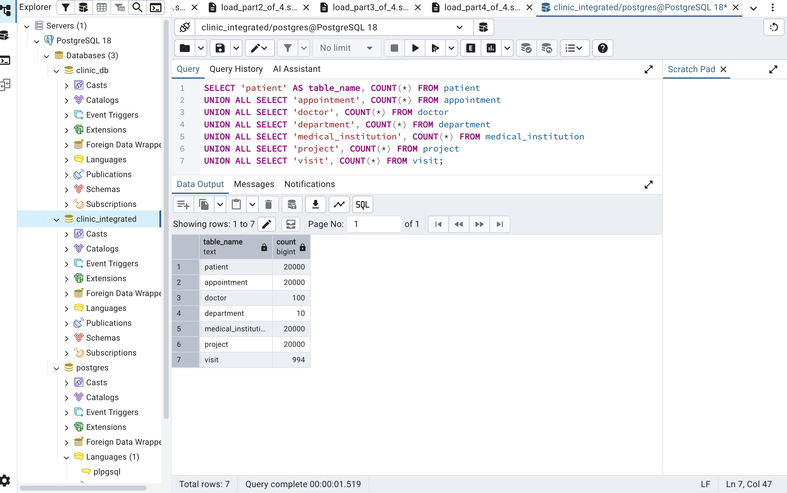

הבסיס מכיל 20,000 מטופלים, 20,000 תורים, 100 רופאים, 10 מחלקות, 20,000 מוסדות רפואיים, 20,000 פרויקטים ו-994 ביקורים.

**כיסוי האלמנטים הנדרשים (a–g):**

| אלמנט | היכן מומש |
|-------|-----------|
| a. Cursor מפורש + סמוי | מפורש: פרוצדורה 1. סמוי: כל SELECT INTO בפונקציות ובפרוצדורות |
| b. החזרת Ref Cursor | פונקציית העזר fn_doctors_by_department |
| c. פקודות DML | פרוצדורה 1 (UPDATE), פרוצדורה 2 (UPDATE), הטריגרים |
| d. הסתעפויות | IF/ELSE בכל התוכניות |
| e. לולאות | LOOP בפרוצדורה 1 |
| f. Exception | RAISE EXCEPTION בפונקציות ובפרוצדורות |
| g. רשומות (RECORD) | פונקציה 2, פרוצדורה 1, תוכנית ראשית 1 |

**הערה:** לא בוצעו שינויים במבנה הטבלאות בשלב זה (לא נדרשו ALTER TABLE), ולכן אין קובץ AlterTable.sql.

---

### פונקציה 1 — סיכום מוסד רפואי (fn_institution_summary)

**קובץ:** `programs/Function1_Institution_Summary.sql`

**תיאור:** הפונקציה מקבלת מזהה מוסד רפואי ומחזירה רשומה עם שם המוסד, מספר המחלקות ומספר הרופאים המשויכים אליו. הפונקציה חוצה את שתי המערכות (medical_institution → department → doctor). תחילה נבדק שהמוסד קיים; אם לא — נזרקת חריגה.

```sql
CREATE OR REPLACE FUNCTION fn_institution_summary(p_institution_id BIGINT)
RETURNS TABLE (
    institution_name VARCHAR,
    department_count BIGINT,
    doctor_count BIGINT
)
LANGUAGE plpgsql
AS $$
DECLARE
    v_exists INTEGER;
BEGIN
    SELECT COUNT(*) INTO v_exists
    FROM medical_institution
    WHERE institution_id = p_institution_id;

    IF v_exists = 0 THEN
        RAISE EXCEPTION 'מוסד רפואי עם מזהה % לא קיים', p_institution_id;
    END IF;

    RETURN QUERY
    SELECT
        mi.name,
        COUNT(DISTINCT d.department_id),
        COUNT(DISTINCT doc.doctor_id)
    FROM medical_institution mi
    LEFT JOIN department d ON d.institution_id = mi.institution_id
    LEFT JOIN doctor doc ON doc.department_id = d.department_id
    WHERE mi.institution_id = p_institution_id
    GROUP BY mi.name;
END;
$$;
```

**יצירת הפונקציה:**

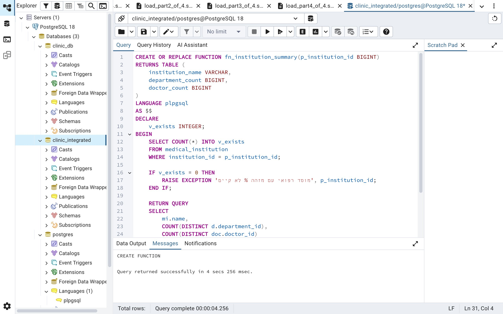

**הרצה תקינה** — `SELECT * FROM fn_institution_summary(1);` החזיר את המוסד "Stephens-Bailey Medical Center" עם 10 מחלקות ו-100 רופאים:

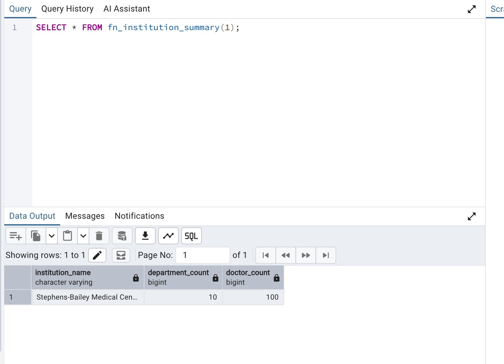

**הוכחת חריגה** — `SELECT * FROM fn_institution_summary(999999);` זרק את החריגה "מוסד רפואי עם מזהה 999999 לא קיים":

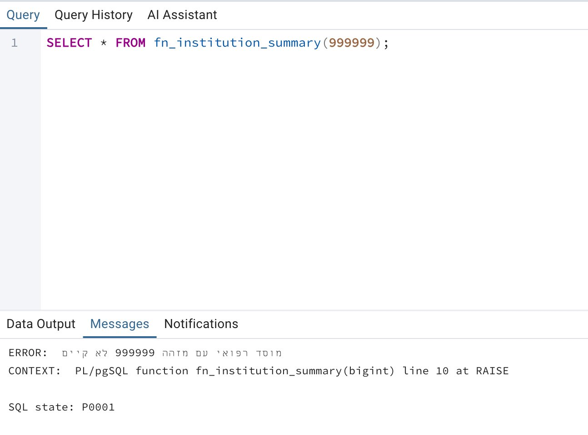

---

### פונקציה 2 — סיכום מטופל (fn_patient_summary)

**קובץ:** `programs/Function2_Patient_Summary.sql`

**תיאור:** הפונקציה מקבלת מזהה מטופל ומחזירה מחרוזת סיכום: שם, גיל מחושב מתאריך הלידה (AGE), מספר ביקורים ותאריך ביקור אחרון. הפונקציה משתמשת ברשומה (RECORD), ומבדילה בין מטופל ללא ביקורים למטופל עם ביקורים. אם המטופל לא קיים — נזרקת חריגה.

```sql
CREATE OR REPLACE FUNCTION fn_patient_summary(p_patient_id INTEGER)
RETURNS TEXT
LANGUAGE plpgsql
AS $$
DECLARE
    v_patient RECORD;
    v_age INTEGER;
    v_visit_count INTEGER;
    v_last_visit DATE;
BEGIN
    SELECT first_name, last_name, birth_date
    INTO v_patient
    FROM patient
    WHERE patient_id = p_patient_id;

    IF NOT FOUND THEN
        RAISE EXCEPTION 'מטופל עם מזהה % לא קיים', p_patient_id;
    END IF;

    v_age := EXTRACT(YEAR FROM AGE(CURRENT_DATE, v_patient.birth_date));

    SELECT COUNT(*), MAX(visit_date)
    INTO v_visit_count, v_last_visit
    FROM visit
    WHERE patient_id = p_patient_id;

    IF v_visit_count = 0 THEN
        RETURN format('מטופל: %s %s, גיל %s. אין ביקורים רשומים.',
                      v_patient.first_name, v_patient.last_name, v_age);
    ELSE
        RETURN format('מטופל: %s %s, גיל %s. מספר ביקורים: %s. ביקור אחרון: %s.',
                      v_patient.first_name, v_patient.last_name, v_age,
                      v_visit_count, v_last_visit);
    END IF;
END;
$$;
```

**יצירת הפונקציה:**

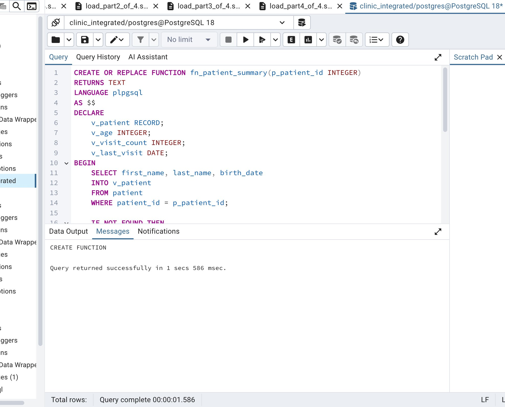

**הרצה תקינה** — `SELECT fn_patient_summary(1);` החזיר "מטופל: Thomas Williams, גיל 75. אין ביקורים רשומים.":

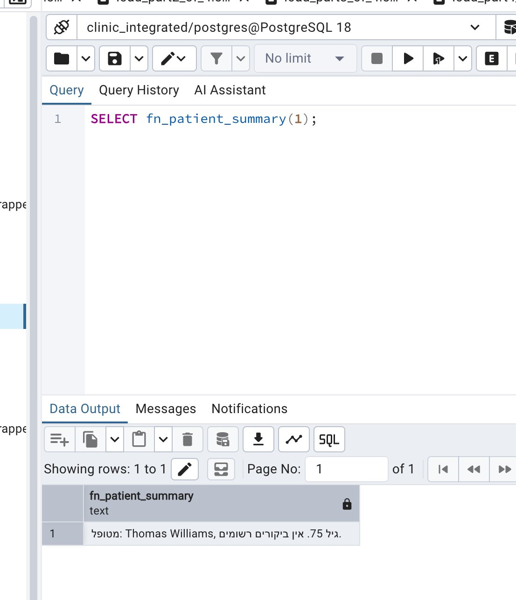

**הוכחת חריגה** — `SELECT fn_patient_summary(999999);` זרק את החריגה "מטופל עם מזהה 999999 לא קיים":

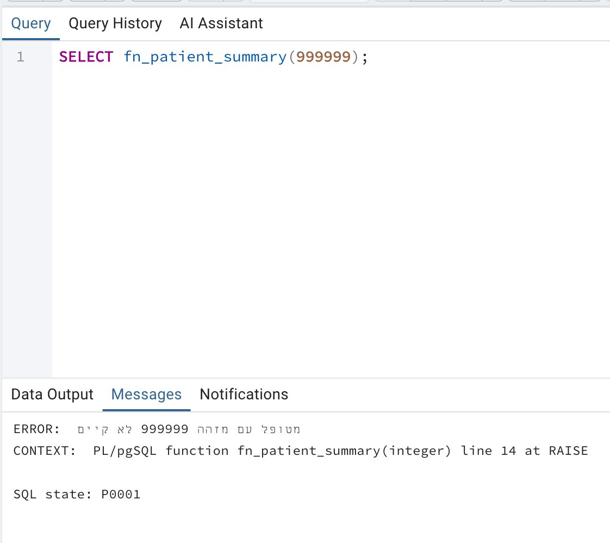

---

### פרוצדורה 1 — ביטול תורים ישנים (sp_cancel_old_appointments)

**קובץ:** `programs/Procedure1_Cancel_Old_Appointments.sql`

**תיאור:** הפרוצדורה מקבלת תאריך ומבטלת את כל התורים במצב 'scheduled' שתאריכם לפני התאריך שהתקבל. הפרוצדורה משתמשת ב-**cursor מפורש** העובר על התורים בלולאה, ובכל איטרציה מבצעת UPDATE שמשנה את הסטטוס ל-'cancelled'.

```sql
CREATE OR REPLACE PROCEDURE sp_cancel_old_appointments(p_before_date DATE)
LANGUAGE plpgsql
AS $$
DECLARE
    cur_appointments CURSOR FOR
        SELECT appointment_id, appointment_date
        FROM appointment
        WHERE status = 'scheduled'
          AND appointment_date < p_before_date;

    v_appointment RECORD;
    v_count INTEGER := 0;
BEGIN
    OPEN cur_appointments;
    LOOP
        FETCH cur_appointments INTO v_appointment;
        EXIT WHEN NOT FOUND;

        UPDATE appointment
        SET status = 'cancelled'
        WHERE appointment_id = v_appointment.appointment_id;

        v_count := v_count + 1;
    END LOOP;
    CLOSE cur_appointments;

    RAISE NOTICE 'בוטלו % תורים שתאריכם לפני %', v_count, p_before_date;
END;
$$;
```

**יצירת הפרוצדורה:**

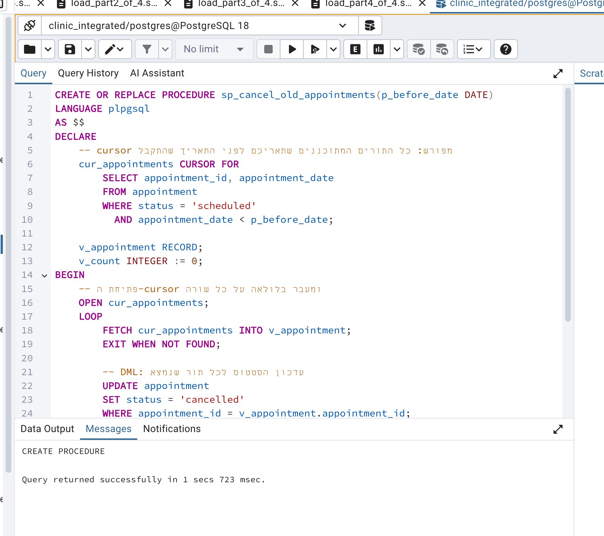

**הרצה ושינוי בבסיס הנתונים** — `CALL sp_cancel_old_appointments('2026-09-01');` הדפיס "בוטלו 507 תורים שתאריכם לפני 2026-09-01" — כלומר 507 שורות עודכנו בפועל:

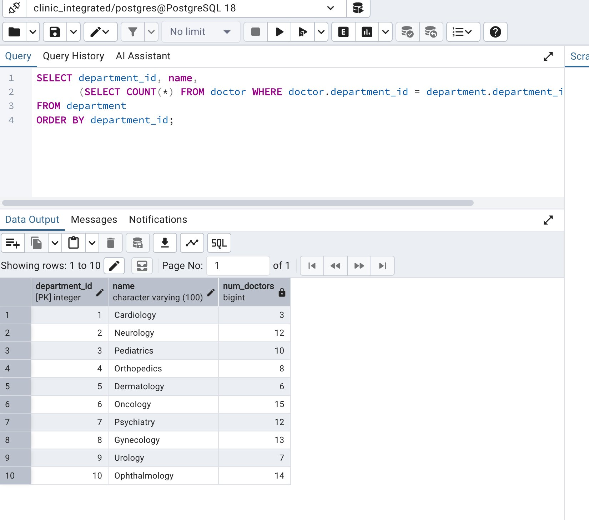

---

### פרוצדורה 2 — העברת רופאים בין מחלקות (sp_transfer_doctors)

**קובץ:** `programs/Procedure2_Transfer_Doctors.sql`

**תיאור:** הפרוצדורה מקבלת מחלקת מקור ומחלקת יעד ומעבירה את כל הרופאים ביניהן. לפני הביצוע מתבצעות ארבע בדיקות תקינות: שהמחלקות שונות, שמחלקת המקור קיימת, שמחלקת היעד קיימת, ושיש רופאים להעביר. ההעברה מבוצעת ב-UPDATE.

**הערה חשובה לגבי שפת ההודעות:** בגרסה הראשונה כתבנו את ההודעות בעברית, אך עורך ה-Query של pgAdmin נכשל בפענוח הקוד עקב בעיית כיווניות (RTL) שבלבלה את ניתוח ה-dollar-quote (`$$`) והחזירה שגיאת "unterminated dollar-quoted string". לכן כתבנו את ההודעות באנגלית והקוד עבר בהצלחה.

**ניסיון ראשון — שגיאת RTL עקב הערות בעברית:**

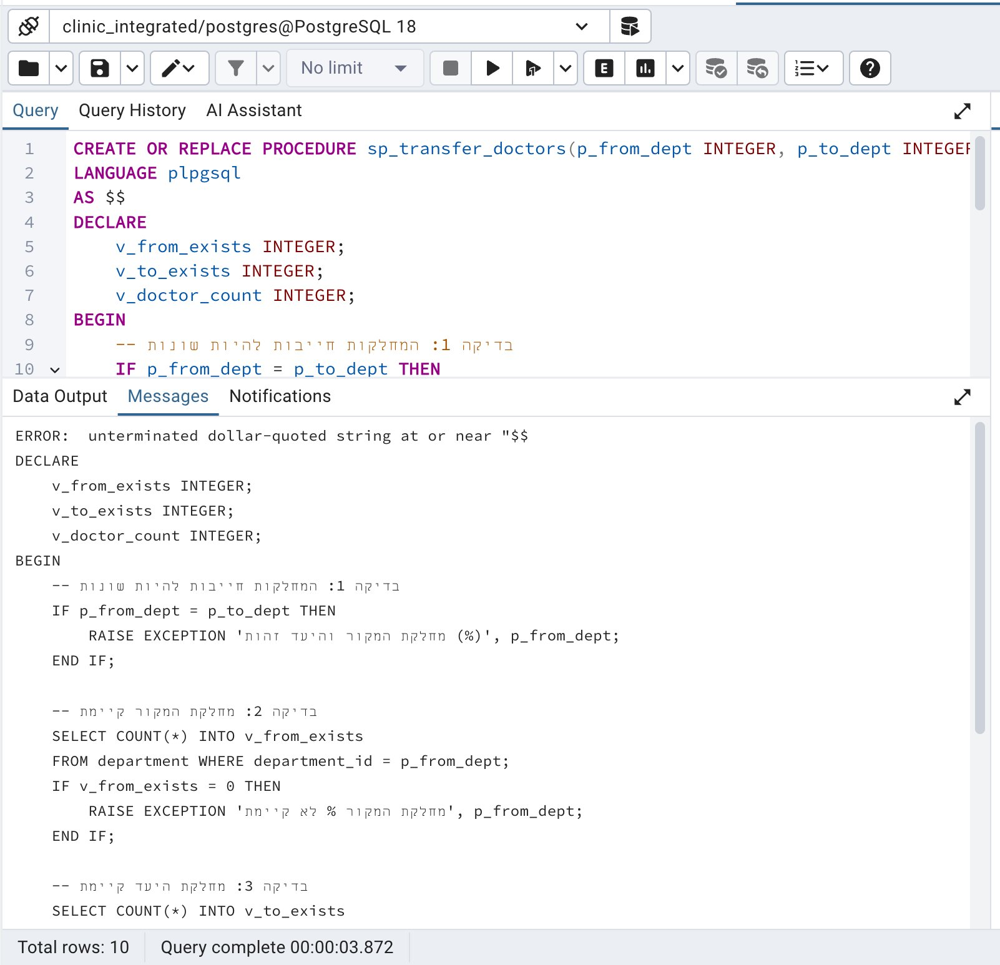

```sql
CREATE OR REPLACE PROCEDURE sp_transfer_doctors(p_from_dept INTEGER, p_to_dept INTEGER)
LANGUAGE plpgsql
AS $$
DECLARE
    v_from_exists INTEGER;
    v_to_exists INTEGER;
    v_doctor_count INTEGER;
BEGIN
    IF p_from_dept = p_to_dept THEN
        RAISE EXCEPTION 'Source and target department are identical (%)', p_from_dept;
    END IF;

    SELECT COUNT(*) INTO v_from_exists
    FROM department WHERE department_id = p_from_dept;
    IF v_from_exists = 0 THEN
        RAISE EXCEPTION 'Source department % does not exist', p_from_dept;
    END IF;

    SELECT COUNT(*) INTO v_to_exists
    FROM department WHERE department_id = p_to_dept;
    IF v_to_exists = 0 THEN
        RAISE EXCEPTION 'Target department % does not exist', p_to_dept;
    END IF;

    SELECT COUNT(*) INTO v_doctor_count
    FROM doctor WHERE department_id = p_from_dept;
    IF v_doctor_count = 0 THEN
        RAISE NOTICE 'No doctors in department % to transfer', p_from_dept;
        RETURN;
    END IF;

    UPDATE doctor
    SET department_id = p_to_dept
    WHERE department_id = p_from_dept;

    RAISE NOTICE 'Transferred % doctors from department % to department %', v_doctor_count, p_from_dept, p_to_dept;
END;
$$;
```

**יצירת הפרוצדורה (הודעות באנגלית) — בהצלחה:**

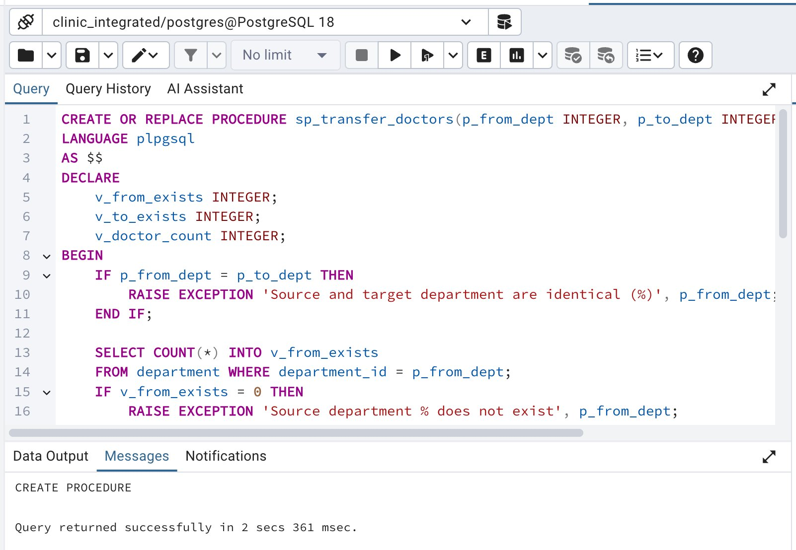

**הרצה ושינוי בבסיס הנתונים** — `CALL sp_transfer_doctors(1, 2);` הדפיס "Transferred 3 doctors from department 1 to department 2":

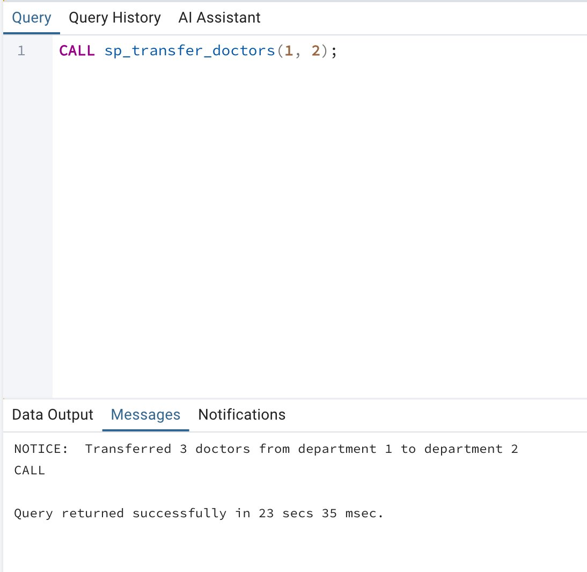

**הוכחת חריגה** — `CALL sp_transfer_doctors(3, 999);` זרק את החריגה "Target department 999 does not exist":

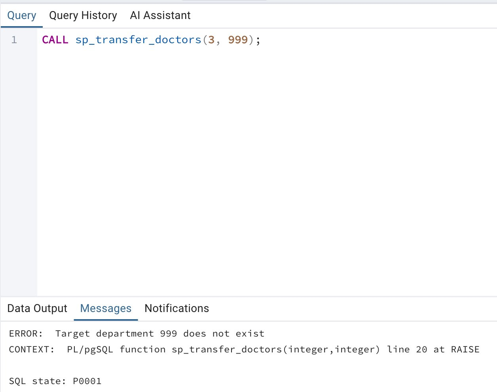

---

### טריגר 1 — בדיקת תאריך תור על UPDATE (tr_appointment_date_check)

**קובץ:** `programs/Trigger1_Check_Appointment_Date.sql`

**תיאור:** זהו הטריגר הנדרש בזמן UPDATE. הטריגר רץ אוטומטית לפני כל עדכון של שורה בטבלת appointment, ובודק שהתאריך החדש אינו בעבר. אם מנסים לקבוע תור לתאריך שעבר — נזרקת חריגה והעדכון נחסם.

```sql
CREATE OR REPLACE FUNCTION trg_check_appointment_date()
RETURNS TRIGGER
LANGUAGE plpgsql
AS $$
BEGIN
    IF NEW.appointment_date < CURRENT_DATE THEN
        RAISE EXCEPTION 'Cannot set appointment date % in the past', NEW.appointment_date;
    END IF;
    RETURN NEW;
END;
$$;

CREATE TRIGGER tr_appointment_date_check
BEFORE UPDATE ON appointment
FOR EACH ROW
EXECUTE FUNCTION trg_check_appointment_date();
```

**יצירת הטריגר:**

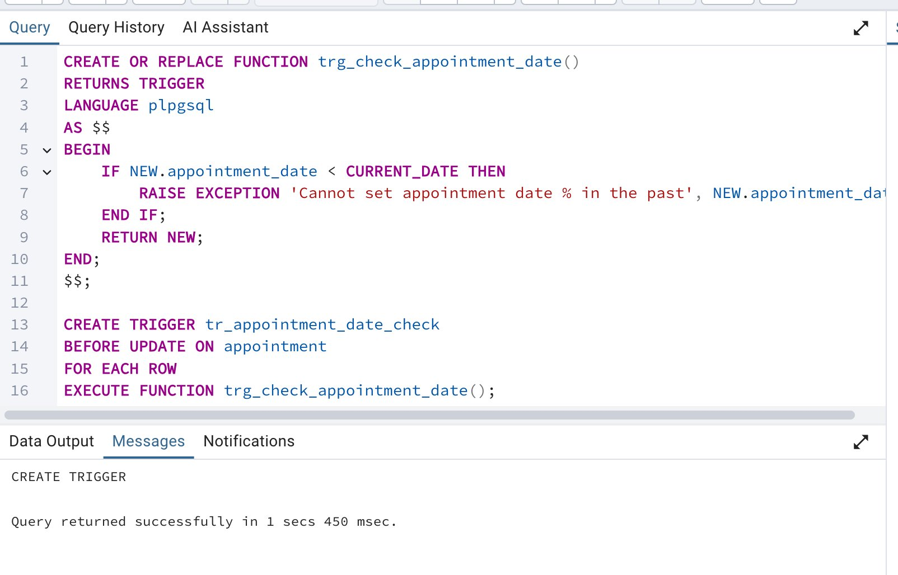

**חסימת עדכון לא חוקי** — `UPDATE appointment SET appointment_date = '2020-01-01' WHERE appointment_id = 20001;` נחסם וזרק "Cannot set appointment date 2020-01-01 in the past":

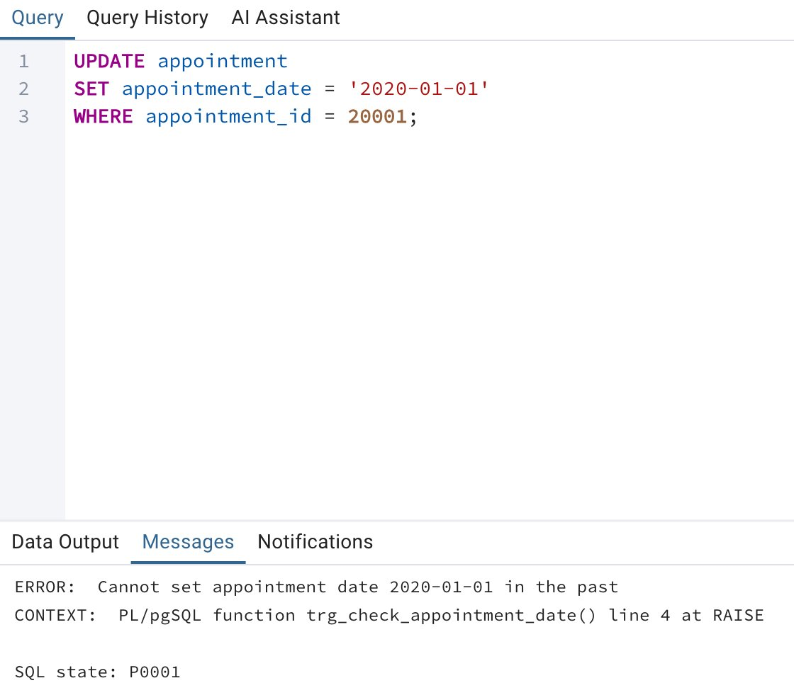

**עדכון חוקי עובר** — `UPDATE appointment SET appointment_date = '2027-01-01' WHERE appointment_id = 20001;` החזיר "UPDATE 1" — העדכון בוצע:

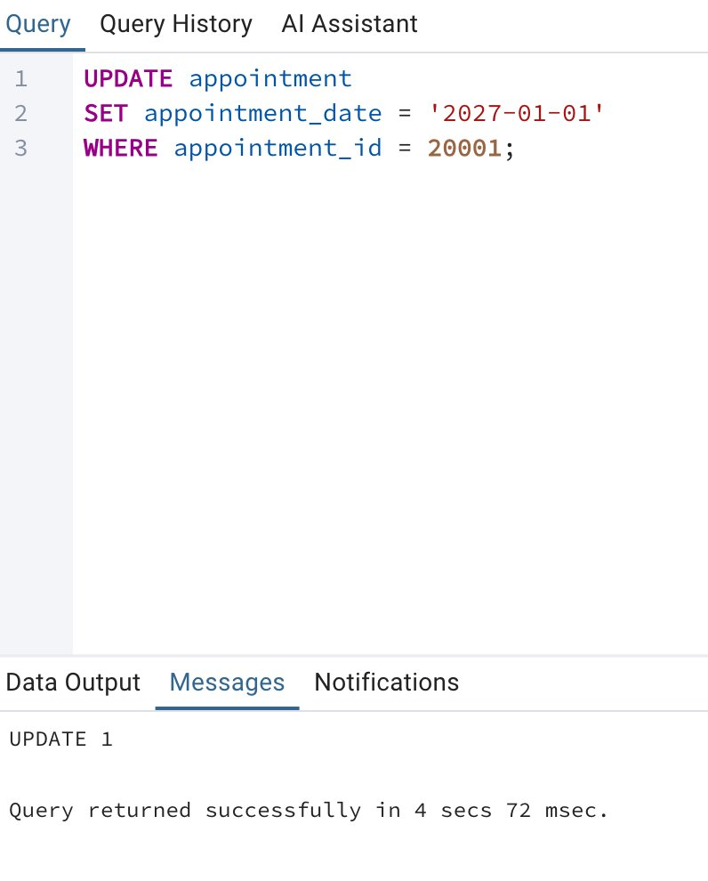

---

### טריגר 2 — נורמליזציית אימייל מטופל על INSERT (tr_patient_email_normalize)

**קובץ:** `programs/Trigger2_Normalize_Patient_Email.sql`

**תיאור:** הטריגר רץ אוטומטית לפני הוספת מטופל חדש, וממיר את כתובת האימייל לאותיות קטנות תוך הסרת רווחים מיותרים (LOWER + TRIM), כדי לשמור על אחידות הנתונים ולמנוע כפילויות.

```sql
CREATE OR REPLACE FUNCTION trg_normalize_patient_email()
RETURNS TRIGGER
LANGUAGE plpgsql
AS $$
BEGIN
    IF NEW.email IS NOT NULL THEN
        NEW.email := LOWER(TRIM(NEW.email));
    END IF;
    RETURN NEW;
END;
$$;

CREATE TRIGGER tr_patient_email_normalize
BEFORE INSERT ON patient
FOR EACH ROW
EXECUTE FUNCTION trg_normalize_patient_email();
```

**יצירת הטריגר:**

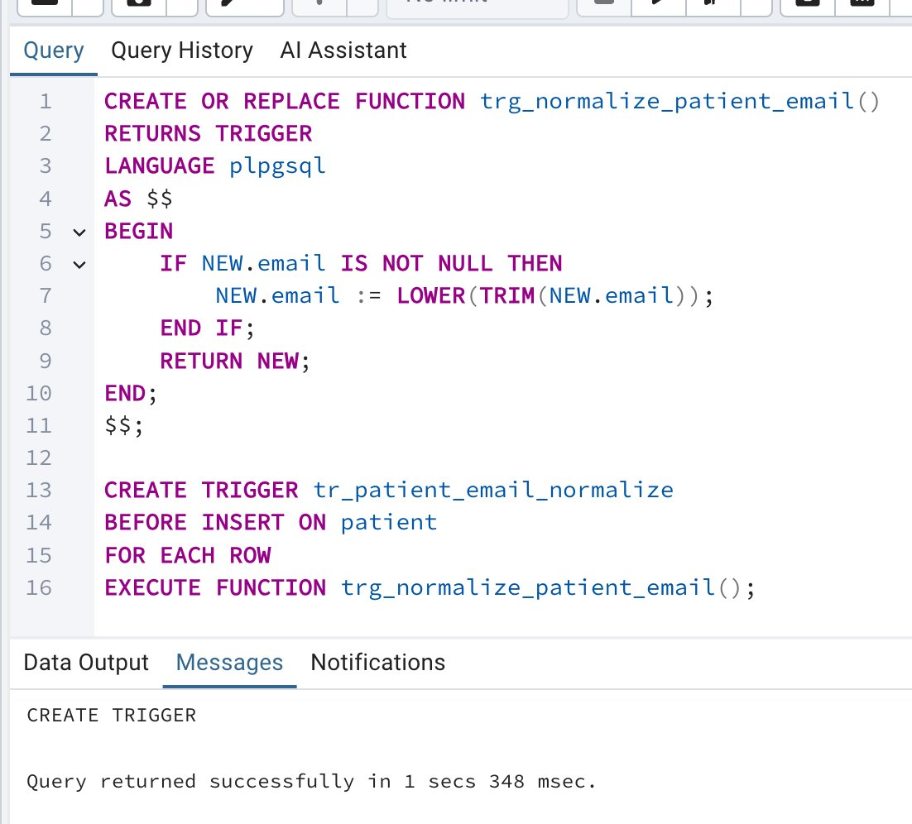

**הוכחת פעולה** — הוספנו מטופל עם האימייל `  TEST.USER@EXAMPLE.COM  ` (אותיות גדולות ורווחים). השליפה לאחר ההוספה הראתה שהאימייל נשמר כ-`test.user@example.com` (קטן, ללא רווחים):

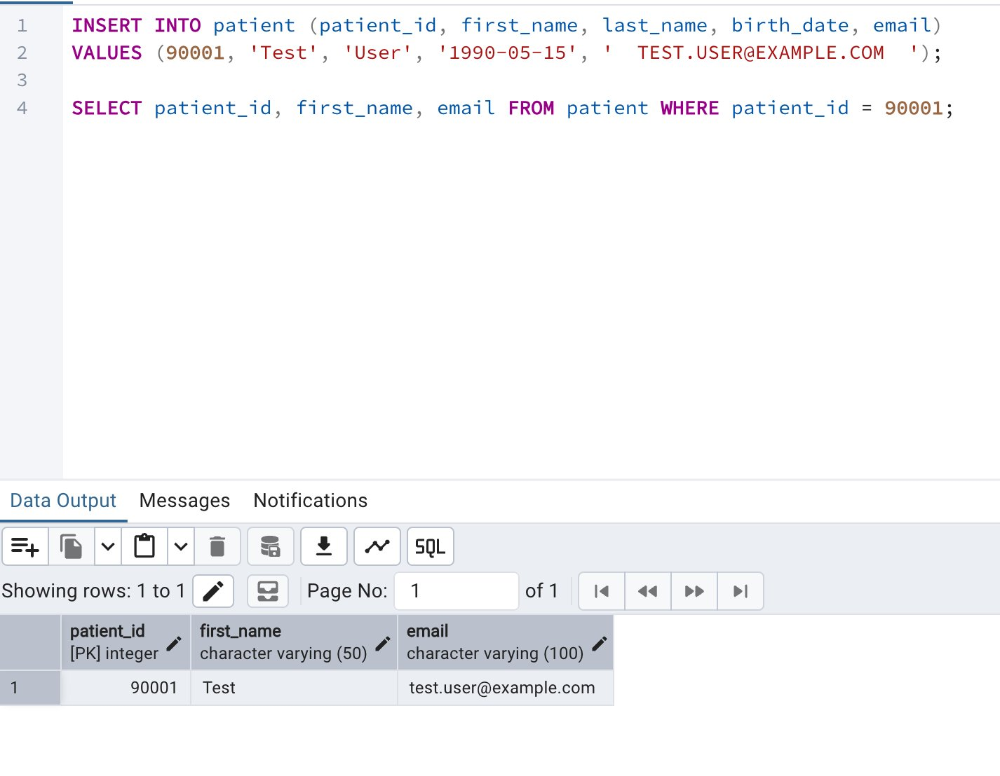

---

### תוכנית ראשית 1 (Main Program 1)

**קובץ:** `programs/MainProgram1.sql`

**תיאור:** בלוק אנונימי DO המדגים זימון של פונקציה ופרוצדורה יחד — קורא לפונקציה `fn_institution_summary(1)`, מדפיס את הסיכום, ואז מזמן את הפרוצדורה `sp_cancel_old_appointments`.

```sql
DO $$
DECLARE
    v_summary RECORD;
BEGIN
    RAISE NOTICE '=== Main Program 1 ===';

    SELECT * INTO v_summary FROM fn_institution_summary(1);
    RAISE NOTICE 'Institution: %, Departments: %, Doctors: %',
                 v_summary.institution_name, v_summary.department_count, v_summary.doctor_count;

    CALL sp_cancel_old_appointments('2026-09-01');

    RAISE NOTICE '=== Done ===';
END;
$$;
```

**הרצה** — ההרצה הדפיסה ברצף את כותרת התוכנית, סיכום המוסד מהפונקציה ("Institution: Stephens-Bailey Medical Center, Departments: 10, Doctors: 100"), הודעת הביטול מהפרוצדורה, והודעת הסיום:

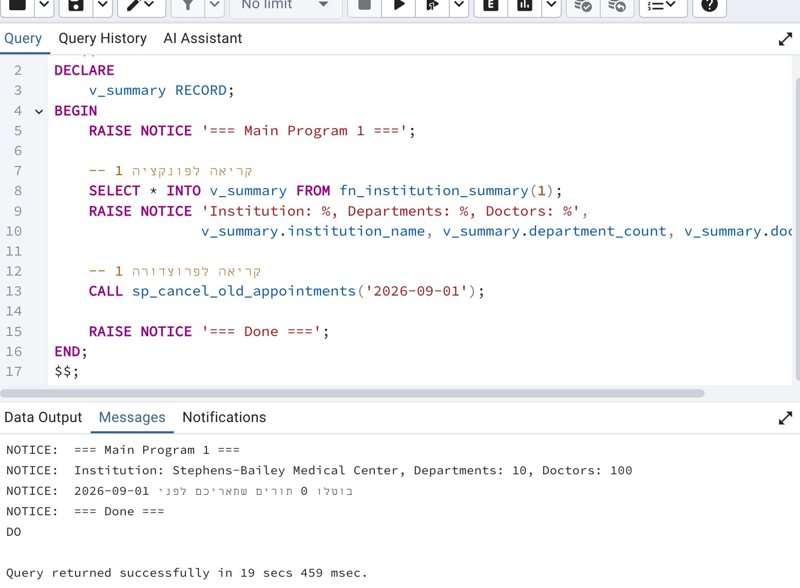

---

### תוכנית ראשית 2 (Main Program 2)

**קובץ:** `programs/MainProgram2.sql`

**תיאור:** בלוק אנונימי DO המזמן את פונקציה 2 ופרוצדורה 2 — קורא לפונקציה `fn_patient_summary(5)`, מדפיס את הסיכום, ואז מזמן את הפרוצדורה `sp_transfer_doctors(5, 6)`.

```sql
DO $$
DECLARE
    v_patient_info TEXT;
BEGIN
    RAISE NOTICE '=== Main Program 2 ===';

    v_patient_info := fn_patient_summary(5);
    RAISE NOTICE 'Patient summary: %', v_patient_info;

    CALL sp_transfer_doctors(5, 6);

    RAISE NOTICE '=== Done ===';
END;
$$;
```

**הרצה** — ההרצה הדפיסה ברצף את כותרת התוכנית, סיכום המטופל ("Patient summary: מטופל: John Jackson, גיל 32. אין ביקורים רשומים."), הודעת העברת הרופאים ("Transferred 6 doctors from department 5 to department 6"), והודעת הסיום:

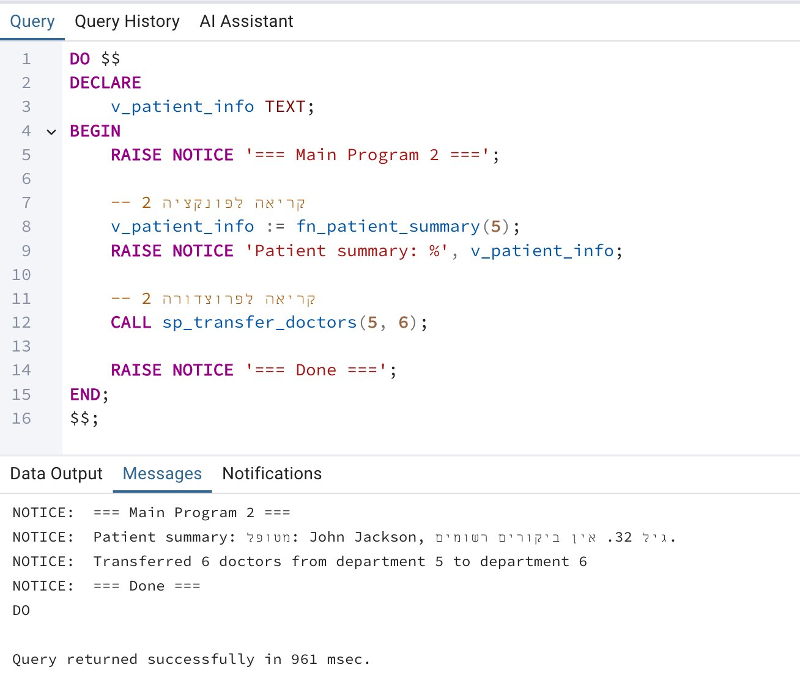

---

### פונקציית עזר — החזרת Ref Cursor (fn_doctors_by_department)

**קובץ:** `programs/Function3_RefCursor_Doctors.sql`

**תיאור:** פונקציית עזר זו מכסה את דרישת "החזרת Ref Cursor" (סעיף b). הפונקציה מקבלת מזהה מחלקה ושם cursor, פותחת cursor (OPEN ... FOR) על כל הרופאים במחלקה, ומחזירה את ה-refcursor. הקריאה החיצונית מבצעת FETCH לשליפת התוצאות.

```sql
CREATE OR REPLACE FUNCTION fn_doctors_by_department(p_department_id INTEGER, p_cursor refcursor)
RETURNS refcursor
LANGUAGE plpgsql
AS $$
BEGIN
    OPEN p_cursor FOR
        SELECT doctor_id, first_name, last_name, specialization
        FROM doctor
        WHERE department_id = p_department_id;
    RETURN p_cursor;
END;
$$;
```

**יצירת הפונקציה:**

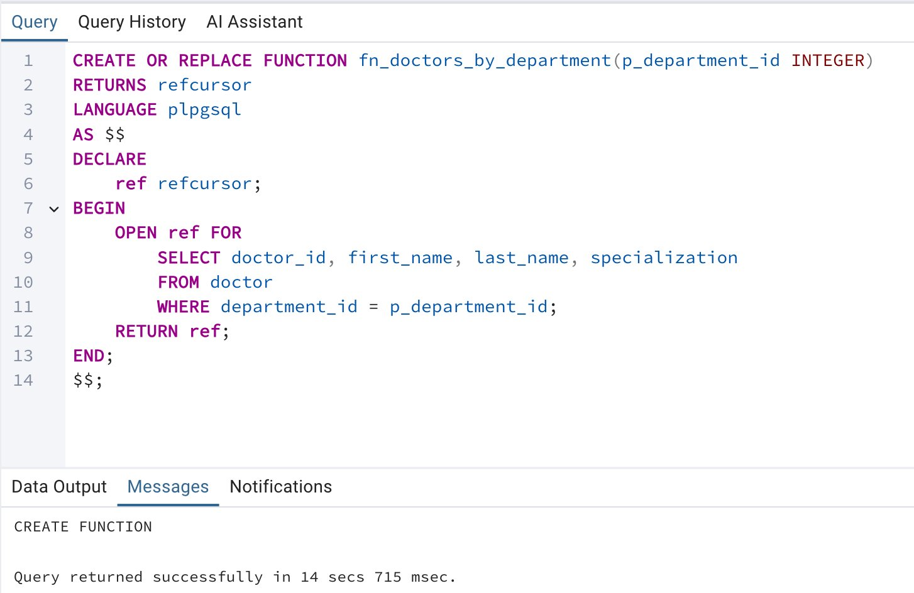

**הרצה בתוך טרנזקציה** — הרצנו את הרצף הבא, וה-FETCH החזיר 15 רופאים ממחלקה 2:

```sql
BEGIN;
SELECT fn_doctors_by_department(2, 'doctor_cur');
FETCH ALL IN doctor_cur;
COMMIT;
```

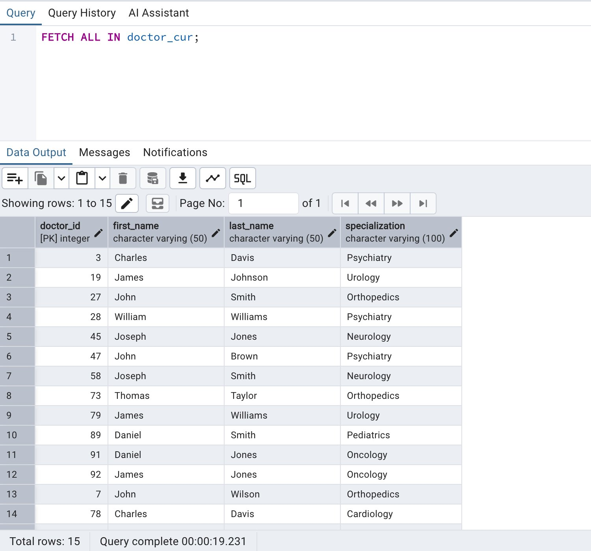

---

### גיבוי

נוצר קובץ גיבוי מעודכן `backup4` (פורמט Custom) של בסיס הנתונים המשולב לאחר הוספת כל התוכניות, באמצעות כלי ה-Backup של pgAdmin:

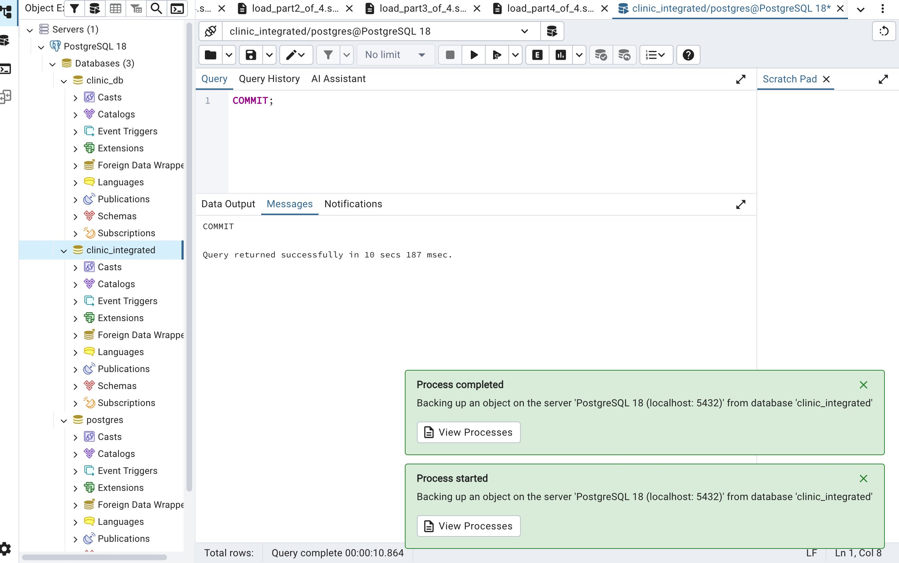

---

### רשימת הקבצים בשלב ד'

- `programs/Function1_Institution_Summary.sql`
- `programs/Function2_Patient_Summary.sql`
- `programs/Procedure1_Cancel_Old_Appointments.sql`
- `programs/Procedure2_Transfer_Doctors.sql`
- `programs/Trigger1_Check_Appointment_Date.sql`
- `programs/Trigger2_Normalize_Patient_Email.sql`
- `programs/MainProgram1.sql`
- `programs/MainProgram2.sql`
- `programs/Function3_RefCursor_Doctors.sql`
- `backup4` — קובץ גיבוי של בסיס הנתונים המשולב
- `screenshots/` — צילומי מסך של ההרצות


# פרויקט מסד נתונים - MediFlow & Build

## שלב ה' - ממשק גרפי (GUI) לאפליקציה

### הוראות כניסה והפעלה:
1. יש לוודא שמותקנת על המחשב סביבת Python.
2. יש לפתוח את הטרמינל (שורת הפקודה) ולהתקין את ספריית התקשורת למסד הנתונים באמצעות הפקודה:
   `pip install pg8000`
3. יש לנווט לתיקיית "שלב ה" ולהריץ את קובץ הניתוב הראשי:
   `python main_gui.py`
4. כעת ייפתח התפריט הראשי, ממנו ניתן לנווט לכל מסכי המערכת.

### דרך העבודה והכלים בהם השתמשנו:
* **שפת תכנות:** Python.
* **ממשק גרפי (GUI):** השתמשנו בספריית `tkinter` המובנית בפייתון לבניית חלונות, כפתורים, ותצוגות טבלאיות (Treeview). הממשק פוצל למספר קבצים מודולריים, כאשר הקובץ הראשי משתמש ב-`subprocess` כדי לזמן מסכים חיצוניים ולשמור על יציבות המערכת.
* **תקשורת נתונים:** השתמשנו בספריית `pg8000` כדי ליצור חיבור (Connection) ישיר ומאובטח לבסיס הנתונים `project2` (PostgreSQL).
* **לוגיקה ו-CRUD:** מומשו 4 פעולות CRUD על מספר טבלאות מרכזיות במערכת. בוצעו שאילתות `JOIN` כדי להציג למשתמש נתונים קריאים (למשל, שם מחלקה במקום ID). בנוסף, יצרנו מסך ייעודי ("פעולות מתקדמות") המריץ את הלוגיקה העסקית, הפונקציות והפרוצדורות שכתבנו בשלב ד' בתוך מסד הנתונים.

### תמונות מסך של האפליקציה פועלת:
ניתן למצוא תמונות של כל המסכים מופעלים ושל הרצת הפעולות בתוך תיקיית `שלב ה/screenshots`.
